# OrchardCore.Themes

## Overview

| Property | Value |
|----------|-------|
| Category | Library |
| Repository | src |
| Path | `OrchardCore.Modules/OrchardCore.Themes/OrchardCore.Themes.csproj` |
| Project References | 7 |
| NuGet Dependencies | 0 |
| Consumers | 3 |

## Dependency Diagram

```mermaid
graph TD
    OrchardCore_Themes["<strong>OrchardCore.Themes</strong>"]
    OrchardCore_Admin_Abstractions["OrchardCore.Admin.Abstractions"]
    OrchardCore_Themes --> OrchardCore_Admin_Abstractions
    OrchardCore_Deployment_Abstractions["OrchardCore.Deployment.Abstractions"]
    OrchardCore_Themes --> OrchardCore_Deployment_Abstractions
    OrchardCore_DisplayManagement["OrchardCore.DisplayManagement"]
    OrchardCore_Themes --> OrchardCore_DisplayManagement
    OrchardCore_Module_Targets["OrchardCore.Module.Targets"]
    OrchardCore_Themes --> OrchardCore_Module_Targets
    OrchardCore_Navigation_Core["OrchardCore.Navigation.Core"]
    OrchardCore_Themes --> OrchardCore_Navigation_Core
    OrchardCore_Recipes_Abstractions["OrchardCore.Recipes.Abstractions"]
    OrchardCore_Themes --> OrchardCore_Recipes_Abstractions
    OrchardCore_ResourceManagement["OrchardCore.ResourceManagement"]
    OrchardCore_Themes --> OrchardCore_ResourceManagement
    TheTheme["TheTheme"]
    TheTheme -.-> OrchardCore_Themes
    TheAdmin["TheAdmin"]
    TheAdmin -.-> OrchardCore_Themes
    OrchardCore_Application_Cms_Core_Targets["OrchardCore.Application.Cms.Core.Targets"]
    OrchardCore_Application_Cms_Core_Targets -.-> OrchardCore_Themes
```

## Project References
- OrchardCore.Admin.Abstractions
- OrchardCore.Deployment.Abstractions
- OrchardCore.DisplayManagement
- OrchardCore.Module.Targets
- OrchardCore.Navigation.Core
- OrchardCore.Recipes.Abstractions
- OrchardCore.ResourceManagement

## Consumed By
- TheTheme
- TheAdmin
- OrchardCore.Application.Cms.Core.Targets

## Data Access Patterns
### API.Controller
| File | Line | Context |
|------|------|---------||
| `src/OrchardCore.Themes/TheTheme/Controllers/HomeController.cs` | 5 | `public sealed class HomeController : Controller` |

---

*[Back to Index](../../index.md)*
