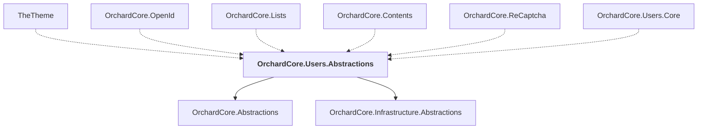

# OrchardCore.Users.Abstractions

## Overview

| Property | Value |
|----------|-------|
| Category | Library |
| Repository | src |
| Path | `OrchardCore/OrchardCore.Users.Abstractions/OrchardCore.Users.Abstractions.csproj` |
| Project References | 2 |
| NuGet Dependencies | 0 |
| Consumers | 6 |

## Dependency Diagram

## Project References
- OrchardCore.Abstractions
- OrchardCore.Infrastructure.Abstractions

## Consumed By
- TheTheme
- OrchardCore.OpenId
- OrchardCore.Lists
- OrchardCore.Contents
- OrchardCore.ReCaptcha
- OrchardCore.Users.Core

---

*[Back to Index](../../index.md)*
