# OrchardCore.Users.Core

## Overview

| Property | Value |
|----------|-------|
| Category | Library |
| Repository | src |
| Path | `OrchardCore/OrchardCore.Users.Core/OrchardCore.Users.Core.csproj` |
| Project References | 6 |
| NuGet Dependencies | 1 |
| Consumers | 10 |

## Dependency Diagram

```mermaid
graph TD
    OrchardCore_Users_Core["<strong>OrchardCore.Users.Core</strong>"]
    OrchardCore_ContentManagement_GraphQL["OrchardCore.ContentManagement.GraphQL"]
    OrchardCore_Users_Core --> OrchardCore_ContentManagement_GraphQL
    OrchardCore_Data_YesSql["OrchardCore.Data.YesSql"]
    OrchardCore_Users_Core --> OrchardCore_Data_YesSql
    OrchardCore_DisplayManagement_Abstractions["OrchardCore.DisplayManagement.Abstractions"]
    OrchardCore_Users_Core --> OrchardCore_DisplayManagement_Abstractions
    OrchardCore_Infrastructure_Abstractions["OrchardCore.Infrastructure.Abstractions"]
    OrchardCore_Users_Core --> OrchardCore_Infrastructure_Abstractions
    OrchardCore_Roles_Core["OrchardCore.Roles.Core"]
    OrchardCore_Users_Core --> OrchardCore_Roles_Core
    OrchardCore_Users_Abstractions["OrchardCore.Users.Abstractions"]
    OrchardCore_Users_Core --> OrchardCore_Users_Abstractions
    TheAdmin["TheAdmin"]
    TheAdmin -.-> OrchardCore_Users_Core
    OrchardCore_Users["OrchardCore.Users"]
    OrchardCore_Users -.-> OrchardCore_Users_Core
    OrchardCore_ContentFields["OrchardCore.ContentFields"]
    OrchardCore_ContentFields -.-> OrchardCore_Users_Core
    OrchardCore_Notifications["OrchardCore.Notifications"]
    OrchardCore_Notifications -.-> OrchardCore_Users_Core
    OrchardCore_Roles["OrchardCore.Roles"]
    OrchardCore_Roles -.-> OrchardCore_Users_Core
    OrchardCore_Demo["OrchardCore.Demo"]
    OrchardCore_Demo -.-> OrchardCore_Users_Core
    OrchardCore_Cors["OrchardCore.Cors"]
    OrchardCore_Cors -.-> OrchardCore_Users_Core
    OrchardCore_ReCaptcha["OrchardCore.ReCaptcha"]
    OrchardCore_ReCaptcha -.-> OrchardCore_Users_Core
    OrchardCore_Notifications_Core["OrchardCore.Notifications.Core"]
    OrchardCore_Notifications_Core -.-> OrchardCore_Users_Core
    OrchardCore_Sms_Core["OrchardCore.Sms.Core"]
    OrchardCore_Sms_Core -.-> OrchardCore_Users_Core
```

## Project References
- OrchardCore.ContentManagement.GraphQL
- OrchardCore.Data.YesSql
- OrchardCore.DisplayManagement.Abstractions
- OrchardCore.Infrastructure.Abstractions
- OrchardCore.Roles.Core
- OrchardCore.Users.Abstractions

## Consumed By
- TheAdmin
- OrchardCore.Users
- OrchardCore.ContentFields
- OrchardCore.Notifications
- OrchardCore.Roles
- OrchardCore.Demo
- OrchardCore.Cors
- OrchardCore.ReCaptcha
- OrchardCore.Notifications.Core
- OrchardCore.Sms.Core

## External NuGet Packages
| Package | Version |
|---------|---------||
| YesSql.Filters.Query |  |

---

*[Back to Index](../../index.md)*
