# OrchardCore.Users

## Overview

| Property | Value |
|----------|-------|
| Category | Library |
| Repository | src |
| Path | `OrchardCore.Modules/OrchardCore.Users/OrchardCore.Users.csproj` |
| Project References | 22 |
| NuGet Dependencies | 0 |
| Consumers | 2 |

## Dependency Diagram

```mermaid
graph TD
    OrchardCore_Users["<strong>OrchardCore.Users</strong>"]
    OrchardCore_Admin_Abstractions["OrchardCore.Admin.Abstractions"]
    OrchardCore_Users --> OrchardCore_Admin_Abstractions
    OrchardCore_Apis_GraphQL_Abstractions["OrchardCore.Apis.GraphQL.Abstractions"]
    OrchardCore_Users --> OrchardCore_Apis_GraphQL_Abstractions
    OrchardCore_AuditTrail_Abstractions["OrchardCore.AuditTrail.Abstractions"]
    OrchardCore_Users --> OrchardCore_AuditTrail_Abstractions
    OrchardCore_ContentManagement_Display["OrchardCore.ContentManagement.Display"]
    OrchardCore_Users --> OrchardCore_ContentManagement_Display
    OrchardCore_ContentManagement_GraphQL["OrchardCore.ContentManagement.GraphQL"]
    OrchardCore_Users --> OrchardCore_ContentManagement_GraphQL
    OrchardCore_Data_Abstractions["OrchardCore.Data.Abstractions"]
    OrchardCore_Users --> OrchardCore_Data_Abstractions
    OrchardCore_DisplayManagement["OrchardCore.DisplayManagement"]
    OrchardCore_Users --> OrchardCore_DisplayManagement
    OrchardCore_Email_Abstractions["OrchardCore.Email.Abstractions"]
    OrchardCore_Users --> OrchardCore_Email_Abstractions
    OrchardCore_Infrastructure_Abstractions["OrchardCore.Infrastructure.Abstractions"]
    OrchardCore_Users --> OrchardCore_Infrastructure_Abstractions
    OrchardCore_Localization_Abstractions["OrchardCore.Localization.Abstractions"]
    OrchardCore_Users --> OrchardCore_Localization_Abstractions
    OrchardCore_Liquid_Abstractions["OrchardCore.Liquid.Abstractions"]
    OrchardCore_Users --> OrchardCore_Liquid_Abstractions
    OrchardCore_Module_Targets["OrchardCore.Module.Targets"]
    OrchardCore_Users --> OrchardCore_Module_Targets
    OrchardCore_Sms_Abstractions["OrchardCore.Sms.Abstractions"]
    OrchardCore_Users --> OrchardCore_Sms_Abstractions
    OrchardCore_Sms_Core["OrchardCore.Sms.Core"]
    OrchardCore_Users --> OrchardCore_Sms_Core
    OrchardCore_Users_Core["OrchardCore.Users.Core"]
    OrchardCore_Users --> OrchardCore_Users_Core
    OrchardCore_Navigation_Core["OrchardCore.Navigation.Core"]
    OrchardCore_Users --> OrchardCore_Navigation_Core
    OrchardCore_Recipes_Abstractions["OrchardCore.Recipes.Abstractions"]
    OrchardCore_Users --> OrchardCore_Recipes_Abstractions
    OrchardCore_ResourceManagement["OrchardCore.ResourceManagement"]
    OrchardCore_Users --> OrchardCore_ResourceManagement
    OrchardCore_Roles_Core["OrchardCore.Roles.Core"]
    OrchardCore_Users --> OrchardCore_Roles_Core
    OrchardCore_Settings_Core["OrchardCore.Settings.Core"]
    OrchardCore_Users --> OrchardCore_Settings_Core
    OrchardCore_Setup_Abstractions["OrchardCore.Setup.Abstractions"]
    OrchardCore_Users --> OrchardCore_Setup_Abstractions
    OrchardCore_Workflows_Abstractions["OrchardCore.Workflows.Abstractions"]
    OrchardCore_Users --> OrchardCore_Workflows_Abstractions
    TheTheme["TheTheme"]
    TheTheme -.-> OrchardCore_Users
    OrchardCore_Application_Cms_Core_Targets["OrchardCore.Application.Cms.Core.Targets"]
    OrchardCore_Application_Cms_Core_Targets -.-> OrchardCore_Users
```

## Project References
- OrchardCore.Admin.Abstractions
- OrchardCore.Apis.GraphQL.Abstractions
- OrchardCore.AuditTrail.Abstractions
- OrchardCore.ContentManagement.Display
- OrchardCore.ContentManagement.GraphQL
- OrchardCore.Data.Abstractions
- OrchardCore.DisplayManagement
- OrchardCore.Email.Abstractions
- OrchardCore.Infrastructure.Abstractions
- OrchardCore.Localization.Abstractions
- OrchardCore.Liquid.Abstractions
- OrchardCore.Module.Targets
- OrchardCore.Sms.Abstractions
- OrchardCore.Sms.Core
- OrchardCore.Users.Core
- OrchardCore.Navigation.Core
- OrchardCore.Recipes.Abstractions
- OrchardCore.ResourceManagement
- OrchardCore.Roles.Core
- OrchardCore.Settings.Core
- OrchardCore.Setup.Abstractions
- OrchardCore.Workflows.Abstractions

## Consumed By
- TheTheme
- OrchardCore.Application.Cms.Core.Targets

---

*[Back to Index](../../index.md)*
