# OrchardCore.Workflows.Abstractions

## Overview

| Property | Value |
|----------|-------|
| Category | Library |
| Repository | src |
| Path | `OrchardCore/OrchardCore.Workflows.Abstractions/OrchardCore.Workflows.Abstractions.csproj` |
| Project References | 2 |
| NuGet Dependencies | 0 |
| Consumers | 11 |

## Dependency Diagram

```mermaid
graph TD
    OrchardCore_Workflows_Abstractions["<strong>OrchardCore.Workflows.Abstractions</strong>"]
    OrchardCore_DisplayManagement["OrchardCore.DisplayManagement"]
    OrchardCore_Workflows_Abstractions --> OrchardCore_DisplayManagement
    OrchardCore_Liquid_Abstractions["OrchardCore.Liquid.Abstractions"]
    OrchardCore_Workflows_Abstractions --> OrchardCore_Liquid_Abstractions
    OrchardCore_Twitter["OrchardCore.Twitter"]
    OrchardCore_Twitter -.-> OrchardCore_Workflows_Abstractions
    OrchardCore_Sms["OrchardCore.Sms"]
    OrchardCore_Sms -.-> OrchardCore_Workflows_Abstractions
    OrchardCore_Workflows["OrchardCore.Workflows"]
    OrchardCore_Workflows -.-> OrchardCore_Workflows_Abstractions
    OrchardCore_Users["OrchardCore.Users"]
    OrchardCore_Users -.-> OrchardCore_Workflows_Abstractions
    OrchardCore_Notifications["OrchardCore.Notifications"]
    OrchardCore_Notifications -.-> OrchardCore_Workflows_Abstractions
    OrchardCore_Contents["OrchardCore.Contents"]
    OrchardCore_Contents -.-> OrchardCore_Workflows_Abstractions
    OrchardCore_Roles["OrchardCore.Roles"]
    OrchardCore_Roles -.-> OrchardCore_Workflows_Abstractions
    OrchardCore_Email["OrchardCore.Email"]
    OrchardCore_Email -.-> OrchardCore_Workflows_Abstractions
    OrchardCore_ReCaptcha["OrchardCore.ReCaptcha"]
    OrchardCore_ReCaptcha -.-> OrchardCore_Workflows_Abstractions
    OrchardCore_Forms["OrchardCore.Forms"]
    OrchardCore_Forms -.-> OrchardCore_Workflows_Abstractions
    OrchardCore_Tenants["OrchardCore.Tenants"]
    OrchardCore_Tenants -.-> OrchardCore_Workflows_Abstractions
```

## Project References
- OrchardCore.DisplayManagement
- OrchardCore.Liquid.Abstractions

## Consumed By
- OrchardCore.Twitter
- OrchardCore.Sms
- OrchardCore.Workflows
- OrchardCore.Users
- OrchardCore.Notifications
- OrchardCore.Contents
- OrchardCore.Roles
- OrchardCore.Email
- OrchardCore.ReCaptcha
- OrchardCore.Forms
- OrchardCore.Tenants

---

*[Back to Index](../../index.md)*
