# OrchardCore.Workflows

## Overview

| Property | Value |
|----------|-------|
| Category | Library |
| Repository | src |
| Path | `OrchardCore.Modules/OrchardCore.Workflows/OrchardCore.Workflows.csproj` |
| Project References | 15 |
| NuGet Dependencies | 1 |
| Consumers | 1 |

## Dependency Diagram

```mermaid
graph TD
    OrchardCore_Workflows["<strong>OrchardCore.Workflows</strong>"]
    OrchardCore_Admin_Abstractions["OrchardCore.Admin.Abstractions"]
    OrchardCore_Workflows --> OrchardCore_Admin_Abstractions
    OrchardCore_ContentManagement_Abstractions["OrchardCore.ContentManagement.Abstractions"]
    OrchardCore_Workflows --> OrchardCore_ContentManagement_Abstractions
    OrchardCore_ContentManagement_Display["OrchardCore.ContentManagement.Display"]
    OrchardCore_Workflows --> OrchardCore_ContentManagement_Display
    OrchardCore_Data_Abstractions["OrchardCore.Data.Abstractions"]
    OrchardCore_Workflows --> OrchardCore_Data_Abstractions
    OrchardCore_Data_YesSql["OrchardCore.Data.YesSql"]
    OrchardCore_Workflows --> OrchardCore_Data_YesSql
    OrchardCore_Deployment_Core["OrchardCore.Deployment.Core"]
    OrchardCore_Workflows --> OrchardCore_Deployment_Core
    OrchardCore_DisplayManagement_Liquid["OrchardCore.DisplayManagement.Liquid"]
    OrchardCore_Workflows --> OrchardCore_DisplayManagement_Liquid
    OrchardCore_DisplayManagement["OrchardCore.DisplayManagement"]
    OrchardCore_Workflows --> OrchardCore_DisplayManagement
    OrchardCore_Navigation_Core["OrchardCore.Navigation.Core"]
    OrchardCore_Workflows --> OrchardCore_Navigation_Core
    OrchardCore_Liquid_Abstractions["OrchardCore.Liquid.Abstractions"]
    OrchardCore_Workflows --> OrchardCore_Liquid_Abstractions
    OrchardCore_Localization_Abstractions["OrchardCore.Localization.Abstractions"]
    OrchardCore_Workflows --> OrchardCore_Localization_Abstractions
    OrchardCore_Module_Targets["OrchardCore.Module.Targets"]
    OrchardCore_Workflows --> OrchardCore_Module_Targets
    OrchardCore_ResourceManagement["OrchardCore.ResourceManagement"]
    OrchardCore_Workflows --> OrchardCore_ResourceManagement
    OrchardCore_ResourceManagement_Abstractions["OrchardCore.ResourceManagement.Abstractions"]
    OrchardCore_Workflows --> OrchardCore_ResourceManagement_Abstractions
    OrchardCore_Workflows_Abstractions["OrchardCore.Workflows.Abstractions"]
    OrchardCore_Workflows --> OrchardCore_Workflows_Abstractions
    OrchardCore_Application_Cms_Core_Targets["OrchardCore.Application.Cms.Core.Targets"]
    OrchardCore_Application_Cms_Core_Targets -.-> OrchardCore_Workflows
```

## Project References
- OrchardCore.Admin.Abstractions
- OrchardCore.ContentManagement.Abstractions
- OrchardCore.ContentManagement.Display
- OrchardCore.Data.Abstractions
- OrchardCore.Data.YesSql
- OrchardCore.Deployment.Core
- OrchardCore.DisplayManagement.Liquid
- OrchardCore.DisplayManagement
- OrchardCore.Navigation.Core
- OrchardCore.Liquid.Abstractions
- OrchardCore.Localization.Abstractions
- OrchardCore.Module.Targets
- OrchardCore.ResourceManagement
- OrchardCore.ResourceManagement.Abstractions
- OrchardCore.Workflows.Abstractions

## Consumed By
- OrchardCore.Application.Cms.Core.Targets

## External NuGet Packages
| Package | Version |
|---------|---------||
| ncrontab |  |

---

*[Back to Index](../../index.md)*
