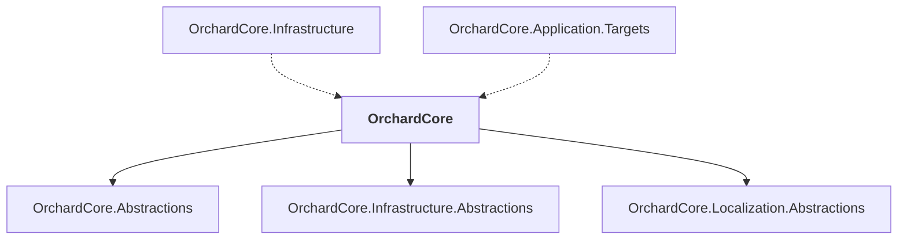

# OrchardCore

## Overview

| Property | Value |
|----------|-------|
| Category | Library |
| Repository | src |
| Path | `OrchardCore/OrchardCore/OrchardCore.csproj` |
| Project References | 3 |
| NuGet Dependencies | 2 |
| Consumers | 2 |

## Dependency Diagram

## Project References
- OrchardCore.Abstractions
- OrchardCore.Infrastructure.Abstractions
- OrchardCore.Localization.Abstractions

## Consumed By
- OrchardCore.Infrastructure
- OrchardCore.Application.Targets

## External NuGet Packages
| Package | Version |
|---------|---------||
| ncrontab |  |
| NodaTime |  |

## Data Access Patterns
### Dapper.Execute
| File | Line | Context |
|------|------|---------||
| `src/OrchardCore/OrchardCore.Setup.Core/Services/SetupService.cs` | 231 | `await recipeExecutor.ExecuteAsync(executionId, context.Recipe, context` |
| `src/OrchardCore/OrchardCore.Indexing.Core/IndexingTaskManager.cs` | 171 | `await transaction.Connection.ExecuteAsync(deleteCmd,` |
| `src/OrchardCore/OrchardCore.Indexing.Core/IndexingTaskManager.cs` | 180 | `await transaction.Connection.ExecuteAsync(insertCmd, localQueue, trans` |
| `src/OrchardCore/OrchardCore.Notifications.Core/DefaultNotificationsAdminListQueryService.cs` | 25 | `query = await options.FilterResult.ExecuteAsync(new NotificationQueryC` |
| `src/OrchardCore/OrchardCore.DisplayManagement/Implementation/DisplayHelper.cs` | 90 | `return _htmlDisplay.ExecuteAsync(context);` |
| `src/OrchardCore/OrchardCore.Recipes.Core/Services/RecipeMigrator.cs` | 57 | `return await _recipeExecutor.ExecuteAsync(executionId, recipeDescripto` |
| `src/OrchardCore/OrchardCore.Recipes.Core/Services/RecipeExecutor.cs` | 180 | `await recipeStepHandler.ExecuteAsync(recipeStep);` |
| `src/OrchardCore/OrchardCore.Infrastructure/Commands/DefaultCommandManager.cs` | 26 | `await match.CommandHandler.ExecuteAsync(match.Context);` |
| `src/OrchardCore/OrchardCore.Data.YesSql/Removing/ShellDbTablesInfo.cs` | 302 | `Connection.Execute(statement, null, Transaction);` |

### Redis.Write
| File | Line | Context |
|------|------|---------||
| `src/OrchardCore/OrchardCore.Setup.Core/Services/SetupService.cs` | 152 | `_httpContextAccessor.HttpContext.Features.Set(recipeEnvironmentFeature` |
| `src/OrchardCore/OrchardCore.DisplayManagement/Razor/RazorViewActionFilter.cs` | 50 | `context.HttpContext.Features.Set(razorViewFeature);` |
| `src/OrchardCore/OrchardCore.Data/Documents/FileDocumentStore.cs` | 43 | `ShellScope.Set(typeof(T), document);` |
| `src/OrchardCore/OrchardCore.Data/Documents/FileDocumentStore.cs` | 67 | `ShellScope.Set(typeof(T), null);` |
| `src/OrchardCore/OrchardCore.Search.Elasticsearch.Core/Services/ElasticsearchIndexNameProvider.cs` | 52 | `_memoryCache.Set(_prefixCacheKey, value);` |
| `src/OrchardCore/OrchardCore.Mvc.Core/LocationExpander/SharedViewLocationExpanderProvider.cs` | 106 | `_memoryCache.Set(PageCacheKey, modulePageSharedViewLocations);` |
| `src/OrchardCore/OrchardCore.Mvc.Core/LocationExpander/SharedViewLocationExpanderProvider.cs` | 118 | `_memoryCache.Set(CacheKey, moduleSharedViewLocations);` |
| `src/OrchardCore/OrchardCore.Mvc.Core/LocationExpander/ComponentViewLocationExpanderProvider.cs` | 118 | `_memoryCache.Set(CacheKey, moduleComponentViewLocations);` |
| `src/OrchardCore/OrchardCore.Mvc.Core/ShellFileVersionProvider.cs` | 114 | `_sharedCache.Set(resolvedPath, value, cacheEntryOptions);` |
| `src/OrchardCore/OrchardCore.Mvc.Core/ShellFileVersionProvider.cs` | 118 | `_cache.Set(cacheKey, value, cacheEntryOptions);` |
| `src/OrchardCore/OrchardCore.Mvc.Core/ShellFileVersionProvider.cs` | 127 | `_cache.Set(cacheKey, string.Empty, cacheEntryOptions);` |
| `src/OrchardCore/OrchardCore.Search.AzureAI.Core/Services/AzureAISearchIndexNameProvider.cs` | 48 | `_memoryCache.Set(_prefixCacheKey, safePrefix);` |
| `src/OrchardCore/OrchardCore.Localization.Core/PortableObject/PoParser.cs` | 49 | `entryBuilder.Set(context, content);` |
| `src/OrchardCore/OrchardCore.Infrastructure/Documents/DocumentManager.cs` | 56 | `ShellScope.Set(DocumentStoreServiceType, documentStore);` |
| `src/OrchardCore/OrchardCore.Infrastructure/Documents/DocumentManager.cs` | 89 | `ShellScope.Set(typeof(TDocument), document);` |

*... and 16 more*

### ConnectionString
| File | Line | Context |
|------|------|---------||
| `src/OrchardCore/OrchardCore.Setup.Core/Services/SetupService.cs` | 158 | `shellSettings["ConnectionString"] = context.Properties.TryGetValue(Set` |
| `src/OrchardCore/OrchardCore.FileStorage.AzureBlob/BlobFileStore.cs` | 53 | `_blobContainer = new BlobContainerClient(_options.ConnectionString, _o` |
| `src/OrchardCore/OrchardCore.FileStorage.AzureBlob/BlobStorageOptionsConfiguration.cs` | 35 | `options.ConnectionString = rawOptions.ConnectionString;` |
| `src/OrchardCore/OrchardCore.FileStorage.AzureBlob/BlobStorageOptions.cs` | 8 | `public string ConnectionString { get; set; }` |
| `src/OrchardCore/OrchardCore.FileStorage.AzureBlob/BlobStorageOptions.cs` | 25 | `return !string.IsNullOrEmpty(ConnectionString) && !string.IsNullOrEmpt` |
| `src/OrchardCore/OrchardCore.Infrastructure/Shells.Database/Configuration/DatabaseShellsStorageOptions.cs` | 9 | `public string ConnectionString { get; set; }` |
| `src/OrchardCore/OrchardCore.Infrastructure/Shells.Database/Extensions/DatabaseShellContextFactoryExtensions.cs` | 24 | `settings["ConnectionString"] = options.ConnectionString;` |
| `src/OrchardCore/OrchardCore.Data.YesSql/SqliteHelper.cs` | 8 | `public static string GetConnectionString(SqliteOptions sqliteOptions, ` |
| `src/OrchardCore/OrchardCore.Data.YesSql/SqliteHelper.cs` | 9 | `=> GetConnectionString(sqliteOptions, GetDatabaseFolder(shellOptions, ` |
| `src/OrchardCore/OrchardCore.Data.YesSql/SqliteHelper.cs` | 19 | `public static string GetConnectionString(SqliteOptions sqliteOptions, ` |
| `src/OrchardCore/OrchardCore.Data.YesSql/SqliteHelper.cs` | 32 | `return GetSqliteConnectionStringBuilder(sqliteOptions, databaseFolder,` |
| `src/OrchardCore/OrchardCore.Data.YesSql/SqliteHelper.cs` | 43 | `public static string GetConnectionString(SqliteOptions sqliteOptions, ` |
| `src/OrchardCore/OrchardCore.Data.YesSql/SqliteHelper.cs` | 48 | `return GetSqliteConnectionStringBuilder(sqliteOptions, databaseFolder,` |
| `src/OrchardCore/OrchardCore.Data.YesSql/SqliteHelper.cs` | 54 | `private static SqliteConnectionStringBuilder GetSqliteConnectionString` |
| `src/OrchardCore/OrchardCore.Data.YesSql/SqliteHelper.cs` | 56 | `return new SqliteConnectionStringBuilder` |

*... and 31 more*

### Dapper.Query
| File | Line | Context |
|------|------|---------||
| `src/OrchardCore/OrchardCore.Indexing.Core/ContentIndexingService.cs` | 88 | `var contentItems = await _readonlySession.Query<ContentItem, ContentIt` |
| `src/OrchardCore/OrchardCore.Indexing.Core/ContentIndexingService.cs` | 96 | `var contentItems = await _readonlySession.Query<ContentItem, ContentIt` |
| `src/OrchardCore/OrchardCore.Indexing.Core/DefaultIndexProfileStore.cs` | 30 | `return await _session.Query<IndexProfile, IndexProfileIndex>()` |
| `src/OrchardCore/OrchardCore.Indexing.Core/DefaultIndexProfileStore.cs` | 39 | `return await _session.Query<IndexProfile, IndexProfileIndex>()` |
| `src/OrchardCore/OrchardCore.Indexing.Core/DefaultIndexProfileStore.cs` | 49 | `return await _session.Query<IndexProfile, IndexProfileIndex>()` |
| `src/OrchardCore/OrchardCore.Indexing.Core/DefaultIndexProfileStore.cs` | 58 | `return await _session.Query<IndexProfile, IndexProfileIndex>()` |
| `src/OrchardCore/OrchardCore.Indexing.Core/DefaultIndexProfileStore.cs` | 67 | `return await _session.Query<IndexProfile, IndexProfileIndex>()` |
| `src/OrchardCore/OrchardCore.Indexing.Core/DefaultIndexProfileStore.cs` | 77 | `return await _session.Query<IndexProfile, IndexProfileIndex>()` |
| `src/OrchardCore/OrchardCore.Indexing.Core/DefaultIndexProfileStore.cs` | 98 | `return await _session.Query<IndexProfile, IndexProfileIndex>().ListAsy` |
| `src/OrchardCore/OrchardCore.Indexing.Core/DefaultIndexProfileStore.cs` | 139 | `var query = _session.Query<IndexProfile, IndexProfileIndex>();` |
| `src/OrchardCore/OrchardCore.Indexing.Core/IndexingTaskManager.cs` | 92 | `return await connection.QueryAsync<RecordIndexingTask>(sqlBuilder.ToSq` |
| `src/OrchardCore/OrchardCore.Notifications.Core/DefaultNotificationsAdminListQueryService.cs` | 23 | `var query = _session.Query<Notification>(collection: NotificationConst` |
| `src/OrchardCore/OrchardCore.Search.Elasticsearch.Core/Providers/ElasticsearchContentPickerResultProvider.cs` | 65 | `.Query(q => q` |
| `src/OrchardCore/OrchardCore.Search.Elasticsearch.Core/Providers/ElasticsearchContentPickerResultProvider.cs` | 81 | `.Query(q => q` |
| `src/OrchardCore/OrchardCore.Search.Elasticsearch.Core/Services/ElasticsearchDocumentIndexManager.cs` | 34 | `.Query(q => q` |

*... and 83 more*

### Redis.Read
| File | Line | Context |
|------|------|---------||
| `src/OrchardCore/OrchardCore.Indexing.Core/DefaultIndexProfileManager.cs` | 198 | `var models = await _store.GetAsync(providerName, type);` |
| `src/OrchardCore/OrchardCore.Email.Core/Services/DefaultEmailService.cs` | 29 | `var provider = await _providerResolver.GetAsync(name);` |
| `src/OrchardCore/OrchardCore.Search.Lucene.Core/Services/LuceneQuerySource.cs` | 93 | `var indexedContentItemVersionIds = docs.TopDocs.ScoreDocs.Select(x => ` |
| `src/OrchardCore/OrchardCore.ContentManagement.GraphQL/Queries/Types/TypedContentTypeBuilder.cs` | 81 | `var resolvedPart = context.Source.Get(partType, nameToResolve);` |
| `src/OrchardCore/OrchardCore.ContentManagement.GraphQL/Queries/Types/TypedContentTypeBuilder.cs` | 107 | `return context.Source.Get(typeToResolve, nameToResolve);` |
| `src/OrchardCore/OrchardCore.ContentManagement.GraphQL/Queries/Types/DynamicContentTypeBuilder.cs` | 198 | `return context.Source.Get(typeToResolve, nameToResolve);` |
| `src/OrchardCore/OrchardCore.ContentManagement.GraphQL/Queries/ContentItemQuery.cs` | 55 | `return await contentManager.GetAsync(contentItemId);` |
| `src/OrchardCore/OrchardCore.Infrastructure/Documents/DocumentManager.cs` | 35 | `_options = options.Get(typeof(TDocument).FullName);` |
| `src/OrchardCore/OrchardCore.Infrastructure/Documents/DocumentManager.cs` | 52 | `var documentStore = (IDocumentStore)ShellScope.Get(DocumentStoreServic` |
| `src/OrchardCore/OrchardCore.Infrastructure/Documents/DocumentManager.cs` | 368 | `data = await _distributedCache.GetAsync(_options.CacheKey);` |
| `src/OrchardCore/OrchardCore.ContentManagement.Abstractions/ContentItemExtensions.cs` | 54 | `part = contentItem.Get(contentElementType, name);` |
| `src/OrchardCore/OrchardCore.ContentManagement.Abstractions/ContentManagerExtensions.cs` | 21 | `(await contentManager.GetAsync(content.ContentItem.ContentItemId, Vers` |
| `src/OrchardCore/OrchardCore.ContentManagement.Abstractions/ContentManagerExtensions.cs` | 76 | `var contentItem = await contentManager.GetAsync(contentItemId, options` |
| `src/OrchardCore/OrchardCore.ContentManagement.Abstractions/ContentExtensions.cs` | 35 | `var result = contentElement.Get(typeof(TElement), name);` |
| `src/OrchardCore/OrchardCore.Contents.Core/Extensions/ContentOrchardHelperExtensions.cs` | 39 | `return await contentManager.GetAsync(contentItemId, option);` |

*... and 19 more*

### MongoDB.Read
| File | Line | Context |
|------|------|---------||
| `src/OrchardCore/OrchardCore.DisplayManagement/Descriptors/ShapePlacementStrategy/ShapePlacementParsingStrategy.cs` | 81 | `predicate = matches.Aggregate(predicate, BuildPredicate);` |
| `src/OrchardCore/OrchardCore.DisplayManagement/BaseDisplayManager.cs` | 54 | `return placementResolvers.Aggregate<IPlacementInfoResolver, PlacementI` |

### File.Read
| File | Line | Context |
|------|------|---------||
| `src/OrchardCore/OrchardCore.Data/Documents/FileDocumentStore.cs` | 98 | `using var stream = File.OpenRead(filename);` |
| `src/OrchardCore/OrchardCore.FileStorage.FileSystem/FileSystemStore.cs` | 247 | `var stream = File.OpenRead(physicalPath);` |
| `src/OrchardCore/OrchardCore.FileStorage.FileSystem/FileSystemStore.cs` | 271 | `var stream = File.OpenRead(physicalPath);` |
| `src/OrchardCore/OrchardCore.Search.Lucene.Core/Services/LuceneIndexingState.cs` | 90 | `_stateDocument = JObject.Parse(await File.ReadAllTextAsync(_stateFileN` |
| `src/OrchardCore/OrchardCore.Shells.Azure/Configuration/BlobShellsConfigurationSources.cs` | 80 | `using var file = File.OpenRead(fileSystemPath);` |
| `src/OrchardCore/OrchardCore.Shells.Azure/Configuration/BlobShellsSettingsSources.cs` | 118 | `using var file = File.OpenRead(_tenantsFileSystemName);` |
| `src/OrchardCore/OrchardCore.Shells.Azure/Configuration/BlobShellConfigurationSources.cs` | 111 | `using var file = File.OpenRead(tenantFile);` |
| `src/OrchardCore/OrchardCore.Infrastructure/Shells.Database/Configuration/DatabaseShellsSettingsSources.cs` | 149 | `using var fileStream = File.OpenRead(_tenants);` |
| `src/OrchardCore/OrchardCore.Infrastructure/Shells.Database/Configuration/DatabaseShellConfigurationSources.cs` | 147 | `using var stream = File.OpenRead(appsettings);` |
| `src/OrchardCore/OrchardCore/Shell/Configuration/ShellsSettingsSources.cs` | 30 | `using var streamReader = File.OpenRead(_tenants);` |
| `src/OrchardCore/OrchardCore/Shell/Configuration/ShellsSettingsSources.cs` | 62 | `using (var streamReader = File.OpenRead(_tenants))` |
| `src/OrchardCore/OrchardCore/Shell/Configuration/ShellConfigurationSources.cs` | 39 | `using var streamReader = File.OpenRead(appsettings);` |

### File.Write
| File | Line | Context |
|------|------|---------||
| `src/OrchardCore/OrchardCore.Data/Documents/FileDocumentStore.cs` | 122 | `using var stream = File.Create(filename);` |
| `src/OrchardCore/OrchardCore.Search.Lucene.Core/Services/LuceneIndexingState.cs` | 59 | `await File.WriteAllTextAsync(_stateFileName, _stateDocument.ToJsonStri` |
| `src/OrchardCore/OrchardCore.Search.Lucene.Core/Services/LuceneIndexingState.cs` | 87 | `await File.WriteAllTextAsync(_stateFileName, new JsonObject().ToJsonSt` |
| `src/OrchardCore/OrchardCore.Media.Core/DefaultMediaFileStoreCacheFileProvider.cs` | 64 | `using var fileStream = File.Create(cachePath);` |
| `src/OrchardCore/OrchardCore/Shell/Configuration/ShellsSettingsSources.cs` | 53 | `using var streamWriter = File.Create(_tenants);` |
| `src/OrchardCore/OrchardCore/Shell/Configuration/ShellsSettingsSources.cs` | 69 | `using var streamWriter = File.Create(_tenants);` |
| `src/OrchardCore/OrchardCore/Shell/Configuration/ShellConfigurationSources.cs` | 61 | `using var streamWriter = File.Create(appsettings);` |
| `src/OrchardCore/OrchardCore.Deployment.Core/Services/TemporaryFileBuilder.cs` | 42 | `using var fs = File.Create(fullname, 4 * 1024, FileOptions.None);` |

### Redis
| File | Line | Context |
|------|------|---------||
| `src/OrchardCore/OrchardCore.Redis.Abstractions/IRedisDatabaseFactory.cs` | 1 | `using StackExchange.Redis;` |
| `src/OrchardCore/OrchardCore.Redis.Abstractions/RedisOptions.cs` | 1 | `using StackExchange.Redis;` |
| `src/OrchardCore/OrchardCore.Redis.Abstractions/IRedisService.cs` | 2 | `using StackExchange.Redis;` |
| `src/OrchardCore/OrchardCore.Redis.Abstractions/IRedisService.cs` | 10 | `IConnectionMultiplexer Connection { get; }` |

### EntityFramework
| File | Line | Context |
|------|------|---------||
| `src/OrchardCore/OrchardCore.Data.YesSql/OrchardCoreBuilderExtensions.cs` | 76 | `.UseSqlServer(shellSettings["ConnectionString"], yesSqlOptions.Isolati` |
| `src/OrchardCore/OrchardCore.Data.YesSql/OrchardCoreBuilderExtensions.cs` | 94 | `.UseMySql(shellSettings["ConnectionString"], yesSqlOptions.IsolationLe` |

### SqlClient
| File | Line | Context |
|------|------|---------||
| `src/OrchardCore/OrchardCore.Data.YesSql/DbConnectionValidator.cs` | 1 | `using Microsoft.Data.SqlClient;` |

### HttpClient.New
| File | Line | Context |
|------|------|---------||
| `src/OrchardCore/OrchardCore/Modules/Overrides/HttpClient/TenantHttpClientFactory.cs` | 119 | `var client = new HttpClient(handler, disposeHandler: false);` |

### HttpClient.Injection
| File | Line | Context |
|------|------|---------||
| `src/OrchardCore/OrchardCore/Modules/Extensions/ServiceCollectionExtensions.cs` | 57 | `.AddHttpClient()` |
| `src/OrchardCore/OrchardCore.ReCaptcha.Core/ServiceCollectionExtensions.cs` | 20 | `.AddHttpClient(nameof(ReCaptchaService))` |
| `src/OrchardCore/OrchardCore.Sms.Core/ServiceCollectionExtensions.cs` | 46 | `services.AddHttpClient(TwilioSmsProvider.TechnicalName, client =>` |

### Kafka.Topic
| File | Line | Context |
|------|------|---------||
| `src/OrchardCore/OrchardCore/Caching/Distributed/DistributedSignal.cs` | 23 | `public override Task ActivatedAsync() => _messageBus.SubscribeAsync("S` |

### HttpClient.BaseAddress
| File | Line | Context |
|------|------|---------||
| `src/OrchardCore/OrchardCore.Sms.Core/ServiceCollectionExtensions.cs` | 48 | `client.BaseAddress = new Uri("https://api.twilio.com/2010-04-01/Accoun` |

### SQL.Delete
| File | Line | Context |
|------|------|---------||
| `src/OrchardCore/OrchardCore.OpenId.Core/YesSql/Migrations/OpenIdMigrations.cs` | 378 | `// Delete from the original collection.` |
| `src/OrchardCore/OrchardCore.OpenId.Core/YesSql/Migrations/OpenIdMigrations.cs` | 389 | `// Delete from the original collection.` |
| `src/OrchardCore/OrchardCore.OpenId.Core/YesSql/Migrations/OpenIdMigrations.cs` | 481 | `// Delete from the original collection.` |
| `src/OrchardCore/OrchardCore.OpenId.Core/YesSql/Migrations/OpenIdMigrations.cs` | 492 | `// Delete from the original collection.` |

---

*[Back to Index](../../index.md)*
