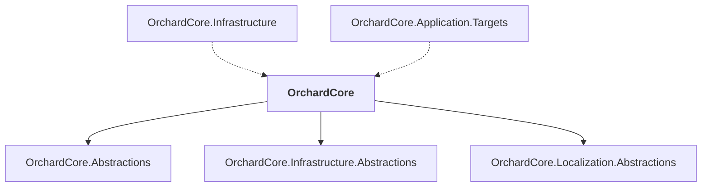

# OrchardCore

## Overview

| Property | Value |
|----------|-------|
| Category | Library |
| Repository | src |
| Path | `OrchardCore/OrchardCore/OrchardCore.csproj` |
| Project References | 3 |
| NuGet Dependencies | 2 |
| Consumers | 2 |

## Dependency Diagram

## Project References
- OrchardCore.Abstractions
- OrchardCore.Infrastructure.Abstractions
- OrchardCore.Localization.Abstractions

## Consumed By
- OrchardCore.Infrastructure
- OrchardCore.Application.Targets

## External NuGet Packages
| Package | Version |
|---------|---------||
| ncrontab |  |
| NodaTime |  |

## Data Access Patterns
### ConnectionString
| File | Line | Context |
|------|------|---------||
| `src/OrchardCore/OrchardCore.Setup.Core/Services/SetupService.cs` | 158 | `shellSettings["ConnectionString"] = context.Properties.TryGetValue(Set` |
| `src/OrchardCore/OrchardCore.FileStorage.AzureBlob/BlobFileStore.cs` | 53 | `_blobContainer = new BlobContainerClient(_options.ConnectionString, _o` |
| `src/OrchardCore/OrchardCore.FileStorage.AzureBlob/BlobStorageOptionsConfiguration.cs` | 35 | `options.ConnectionString = rawOptions.ConnectionString;` |
| `src/OrchardCore/OrchardCore.FileStorage.AzureBlob/BlobStorageOptions.cs` | 8 | `public string ConnectionString { get; set; }` |
| `src/OrchardCore/OrchardCore.FileStorage.AzureBlob/BlobStorageOptions.cs` | 25 | `return !string.IsNullOrEmpty(ConnectionString) && !string.IsNullOrEmpt` |
| `src/OrchardCore/OrchardCore.Infrastructure/Shells.Database/Configuration/DatabaseShellsStorageOptions.cs` | 9 | `public string ConnectionString { get; set; }` |
| `src/OrchardCore/OrchardCore.Infrastructure/Shells.Database/Extensions/DatabaseShellContextFactoryExtensions.cs` | 24 | `settings["ConnectionString"] = options.ConnectionString;` |
| `src/OrchardCore/OrchardCore.Data.YesSql/SqliteHelper.cs` | 8 | `public static string GetConnectionString(SqliteOptions sqliteOptions, ` |
| `src/OrchardCore/OrchardCore.Data.YesSql/SqliteHelper.cs` | 9 | `=> GetConnectionString(sqliteOptions, GetDatabaseFolder(shellOptions, ` |
| `src/OrchardCore/OrchardCore.Data.YesSql/SqliteHelper.cs` | 19 | `public static string GetConnectionString(SqliteOptions sqliteOptions, ` |
| `src/OrchardCore/OrchardCore.Data.YesSql/SqliteHelper.cs` | 32 | `return GetSqliteConnectionStringBuilder(sqliteOptions, databaseFolder,` |
| `src/OrchardCore/OrchardCore.Data.YesSql/SqliteHelper.cs` | 43 | `public static string GetConnectionString(SqliteOptions sqliteOptions, ` |
| `src/OrchardCore/OrchardCore.Data.YesSql/SqliteHelper.cs` | 48 | `return GetSqliteConnectionStringBuilder(sqliteOptions, databaseFolder,` |
| `src/OrchardCore/OrchardCore.Data.YesSql/SqliteHelper.cs` | 54 | `private static SqliteConnectionStringBuilder GetSqliteConnectionString` |
| `src/OrchardCore/OrchardCore.Data.YesSql/SqliteHelper.cs` | 56 | `return new SqliteConnectionStringBuilder` |

*... and 31 more*

### Dapper
| File | Line | Context |
|------|------|---------||
| `src/OrchardCore/OrchardCore.Indexing.Core/ContentIndexingService.cs` | 88 | `var contentItems = await _readonlySession.Query<ContentItem, ContentIt` |
| `src/OrchardCore/OrchardCore.Indexing.Core/ContentIndexingService.cs` | 96 | `var contentItems = await _readonlySession.Query<ContentItem, ContentIt` |
| `src/OrchardCore/OrchardCore.Indexing.Core/DefaultIndexProfileStore.cs` | 30 | `return await _session.Query<IndexProfile, IndexProfileIndex>()` |
| `src/OrchardCore/OrchardCore.Indexing.Core/DefaultIndexProfileStore.cs` | 39 | `return await _session.Query<IndexProfile, IndexProfileIndex>()` |
| `src/OrchardCore/OrchardCore.Indexing.Core/DefaultIndexProfileStore.cs` | 49 | `return await _session.Query<IndexProfile, IndexProfileIndex>()` |
| `src/OrchardCore/OrchardCore.Indexing.Core/DefaultIndexProfileStore.cs` | 58 | `return await _session.Query<IndexProfile, IndexProfileIndex>()` |
| `src/OrchardCore/OrchardCore.Indexing.Core/DefaultIndexProfileStore.cs` | 67 | `return await _session.Query<IndexProfile, IndexProfileIndex>()` |
| `src/OrchardCore/OrchardCore.Indexing.Core/DefaultIndexProfileStore.cs` | 77 | `return await _session.Query<IndexProfile, IndexProfileIndex>()` |
| `src/OrchardCore/OrchardCore.Indexing.Core/DefaultIndexProfileStore.cs` | 98 | `return await _session.Query<IndexProfile, IndexProfileIndex>().ListAsy` |
| `src/OrchardCore/OrchardCore.Indexing.Core/DefaultIndexProfileStore.cs` | 139 | `var query = _session.Query<IndexProfile, IndexProfileIndex>();` |
| `src/OrchardCore/OrchardCore.Notifications.Core/DefaultNotificationsAdminListQueryService.cs` | 23 | `var query = _session.Query<Notification>(collection: NotificationConst` |
| `src/OrchardCore/OrchardCore.Search.Elasticsearch.Core/Providers/ElasticsearchContentPickerResultProvider.cs` | 65 | `.Query(q => q` |
| `src/OrchardCore/OrchardCore.Search.Elasticsearch.Core/Providers/ElasticsearchContentPickerResultProvider.cs` | 81 | `.Query(q => q` |
| `src/OrchardCore/OrchardCore.Search.Elasticsearch.Core/Services/ElasticsearchDocumentIndexManager.cs` | 34 | `.Query(q => q` |
| `src/OrchardCore/OrchardCore.Search.Elasticsearch.Core/Services/ElasticsearchDocumentIndexManager.cs` | 67 | `.Query(q => q` |

*... and 83 more*

### RabbitMQ
| File | Line | Context |
|------|------|---------||
| `src/OrchardCore/OrchardCore.Notifications.Core/Services/NotificationFilterEngineModelBinder.cs` | 5 | `public class NotificationFilterEngineModelBinder : IModelBinder` |
| `src/OrchardCore/OrchardCore.Mvc.Core/ModelBinding/CheckMarkModelBinder.cs` | 5 | `public class CheckMarkModelBinder : IModelBinder` |
| `src/OrchardCore/OrchardCore.Mvc.Core/ModelBinding/SafeBoolModelBinderProvider.cs` | 5 | `internal sealed class SafeBoolModelBinderProvider : IModelBinderProvid` |
| `src/OrchardCore/OrchardCore.Mvc.Core/ModelBinding/SafeBoolModelBinderProvider.cs` | 7 | `public IModelBinder GetBinder(ModelBinderProviderContext context)` |
| `src/OrchardCore/OrchardCore.Mvc.Core/ModelBinding/CheckMarkModelBinderProvider.cs` | 6 | `/// An <see cref="IModelBinderProvider"/> for <see cref="CheckMarkMode` |
| `src/OrchardCore/OrchardCore.Mvc.Core/ModelBinding/CheckMarkModelBinderProvider.cs` | 8 | `public class CheckMarkModelBinderProvider : IModelBinderProvider` |
| `src/OrchardCore/OrchardCore.Mvc.Core/ModelBinding/CheckMarkModelBinderProvider.cs` | 11 | `public IModelBinder GetBinder(ModelBinderProviderContext context)` |
| `src/OrchardCore/OrchardCore.Mvc.Core/ModelBinding/SafeBoolModelBinder.cs` | 12 | `internal sealed class SafeBoolModelBinder : IModelBinder` |
| `src/OrchardCore/OrchardCore.Infrastructure.Abstractions/Entities/ModelHandlerBase.cs` | 3 | `public abstract class ModelHandlerBase<T> : IModelHandler<T>` |
| `src/OrchardCore/OrchardCore.Infrastructure.Abstractions/Entities/IModelHandler.cs` | 3 | `public interface IModelHandler<T>` |
| `src/OrchardCore/OrchardCore.Indexing.Abstractions/IIndexProfileHandler.cs` | 6 | `public interface IIndexProfileHandler : IModelHandler<IndexProfile>` |
| `src/OrchardCore/OrchardCore.Contents.Core/Services/ContentItemFilterEngineModelBinder.cs` | 5 | `public class ContentItemFilterEngineModelBinder : IModelBinder` |
| `src/OrchardCore/OrchardCore.Users.Core/Services/UserFilterEngineModelBinder.cs` | 5 | `public class UserFilterEngineModelBinder : IModelBinder` |
| `src/OrchardCore/OrchardCore.AuditTrail.Abstractions/Services/AuditTrailFilterEngineModelBinder.cs` | 5 | `public class AuditTrailFilterEngineModelBinder : IModelBinder` |

### FileStorage
| File | Line | Context |
|------|------|---------||
| `src/OrchardCore/OrchardCore.Data/Documents/FileDocumentStore.cs` | 122 | `using var stream = File.Create(filename);` |
| `src/OrchardCore/OrchardCore.Media.Core/DefaultMediaFileStoreCacheFileProvider.cs` | 64 | `using var fileStream = File.Create(cachePath);` |
| `src/OrchardCore/OrchardCore/Shell/Configuration/ShellsSettingsSources.cs` | 53 | `using var streamWriter = File.Create(_tenants);` |
| `src/OrchardCore/OrchardCore/Shell/Configuration/ShellsSettingsSources.cs` | 69 | `using var streamWriter = File.Create(_tenants);` |
| `src/OrchardCore/OrchardCore/Shell/Configuration/ShellConfigurationSources.cs` | 61 | `using var streamWriter = File.Create(appsettings);` |
| `src/OrchardCore/OrchardCore.Deployment.Core/Services/TemporaryFileBuilder.cs` | 42 | `using var fs = File.Create(fullname, 4 * 1024, FileOptions.None);` |

### Redis
| File | Line | Context |
|------|------|---------||
| `src/OrchardCore/OrchardCore.Redis.Abstractions/IRedisDatabaseFactory.cs` | 1 | `using StackExchange.Redis;` |
| `src/OrchardCore/OrchardCore.Redis.Abstractions/RedisOptions.cs` | 1 | `using StackExchange.Redis;` |
| `src/OrchardCore/OrchardCore.Redis.Abstractions/IRedisService.cs` | 2 | `using StackExchange.Redis;` |
| `src/OrchardCore/OrchardCore.Redis.Abstractions/IRedisService.cs` | 10 | `IConnectionMultiplexer Connection { get; }` |

### EntityFramework
| File | Line | Context |
|------|------|---------||
| `src/OrchardCore/OrchardCore.Data.YesSql/OrchardCoreBuilderExtensions.cs` | 76 | `.UseSqlServer(shellSettings["ConnectionString"], yesSqlOptions.Isolati` |
| `src/OrchardCore/OrchardCore.Data.YesSql/OrchardCoreBuilderExtensions.cs` | 94 | `.UseMySql(shellSettings["ConnectionString"], yesSqlOptions.IsolationLe` |

### SqlClient
| File | Line | Context |
|------|------|---------||
| `src/OrchardCore/OrchardCore.Data.YesSql/DbConnectionValidator.cs` | 1 | `using Microsoft.Data.SqlClient;` |

### HttpClient.New
| File | Line | Context |
|------|------|---------||
| `src/OrchardCore/OrchardCore/Modules/Overrides/HttpClient/TenantHttpClientFactory.cs` | 119 | `var client = new HttpClient(handler, disposeHandler: false);` |

### HttpClient.Injection
| File | Line | Context |
|------|------|---------||
| `src/OrchardCore/OrchardCore/Modules/Extensions/ServiceCollectionExtensions.cs` | 57 | `.AddHttpClient()` |
| `src/OrchardCore/OrchardCore.ReCaptcha.Core/ServiceCollectionExtensions.cs` | 20 | `.AddHttpClient(nameof(ReCaptchaService))` |
| `src/OrchardCore/OrchardCore.Sms.Core/ServiceCollectionExtensions.cs` | 46 | `services.AddHttpClient(TwilioSmsProvider.TechnicalName, client =>` |

### HttpClient.BaseAddress
| File | Line | Context |
|------|------|---------||
| `src/OrchardCore/OrchardCore.Sms.Core/ServiceCollectionExtensions.cs` | 48 | `client.BaseAddress = new Uri("https://api.twilio.com/2010-04-01/Accoun` |

---

*[Back to Index](../../index.md)*
