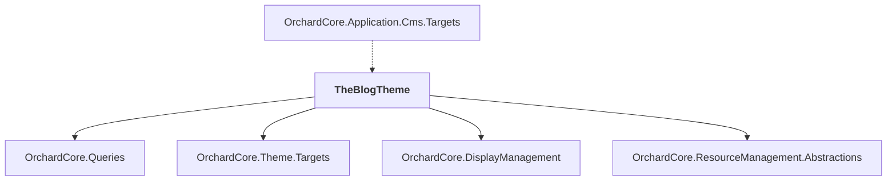

# TheBlogTheme

## Overview

| Property | Value |
|----------|-------|
| Category | Library |
| Repository | src |
| Path | `OrchardCore.Themes/TheBlogTheme/TheBlogTheme.csproj` |
| Project References | 4 |
| NuGet Dependencies | 0 |
| Consumers | 1 |

## Dependency Diagram

## Project References
- OrchardCore.Queries
- OrchardCore.Theme.Targets
- OrchardCore.DisplayManagement
- OrchardCore.ResourceManagement.Abstractions

## Consumed By
- OrchardCore.Application.Cms.Targets

---

*[Back to Index](../../index.md)*
