# TheTheme

## Overview

| Property | Value |
|----------|-------|
| Category | Library |
| Repository | src |
| Path | `OrchardCore.Themes/TheTheme/TheTheme.csproj` |
| Project References | 11 |
| NuGet Dependencies | 0 |
| Consumers | 1 |

## Dependency Diagram

```mermaid
graph TD
    TheTheme["<strong>TheTheme</strong>"]
    OrchardCore_Flows["OrchardCore.Flows"]
    TheTheme --> OrchardCore_Flows
    OrchardCore_Notifications["OrchardCore.Notifications"]
    TheTheme --> OrchardCore_Notifications
    OrchardCore_Themes["OrchardCore.Themes"]
    TheTheme --> OrchardCore_Themes
    OrchardCore_Theme_Targets["OrchardCore.Theme.Targets"]
    TheTheme --> OrchardCore_Theme_Targets
    OrchardCore_Admin_Abstractions["OrchardCore.Admin.Abstractions"]
    TheTheme --> OrchardCore_Admin_Abstractions
    OrchardCore_ContentManagement["OrchardCore.ContentManagement"]
    TheTheme --> OrchardCore_ContentManagement
    OrchardCore_ResourceManagement["OrchardCore.ResourceManagement"]
    TheTheme --> OrchardCore_ResourceManagement
    OrchardCore_DisplayManagement["OrchardCore.DisplayManagement"]
    TheTheme --> OrchardCore_DisplayManagement
    OrchardCore_Users_Abstractions["OrchardCore.Users.Abstractions"]
    TheTheme --> OrchardCore_Users_Abstractions
    OrchardCore_Users["OrchardCore.Users"]
    TheTheme --> OrchardCore_Users
    OrchardCore_Menu["OrchardCore.Menu"]
    TheTheme --> OrchardCore_Menu
    OrchardCore_Application_Cms_Targets["OrchardCore.Application.Cms.Targets"]
    OrchardCore_Application_Cms_Targets -.-> TheTheme
```

## Project References
- OrchardCore.Flows
- OrchardCore.Notifications
- OrchardCore.Themes
- OrchardCore.Theme.Targets
- OrchardCore.Admin.Abstractions
- OrchardCore.ContentManagement
- OrchardCore.ResourceManagement
- OrchardCore.DisplayManagement
- OrchardCore.Users.Abstractions
- OrchardCore.Users
- OrchardCore.Menu

## Consumed By
- OrchardCore.Application.Cms.Targets

---

*[Back to Index](../../index.md)*
