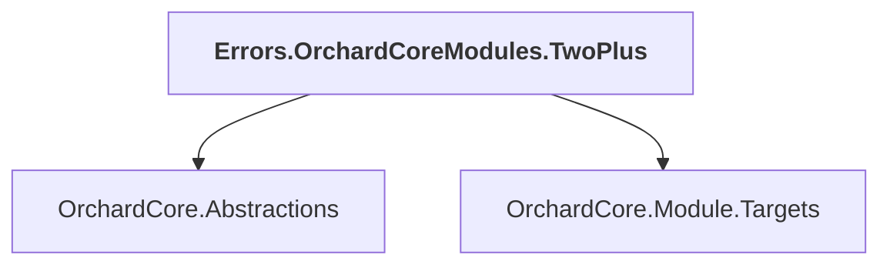

# Errors.OrchardCoreModules.TwoPlus

## Overview

| Property | Value |
|----------|-------|
| Category | Test |
| Repository | test |
| Path | `OrchardCore.Tests.Modules/Errors.OrchardCoreModules.TwoPlus/Errors.OrchardCoreModules.TwoPlus.csproj` |
| Project References | 2 |
| NuGet Dependencies | 0 |
| Consumers | 0 |

## Dependency Diagram

## Project References
- OrchardCore.Abstractions
- OrchardCore.Module.Targets

---

*[Back to Index](../../index.md)*
