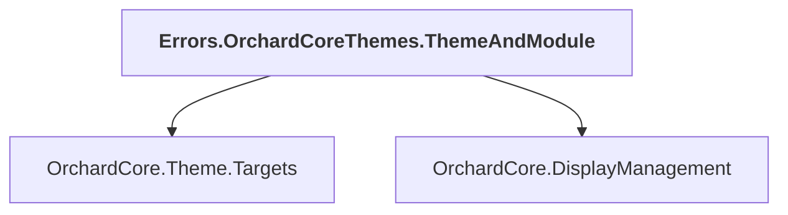

# Errors.OrchardCoreThemes.ThemeAndModule

## Overview

| Property | Value |
|----------|-------|
| Category | Test |
| Repository | test |
| Path | `OrchardCore.Tests.Themes/Errors.OrchardCoreThemes.ThemeAndModule/Errors.OrchardCoreThemes.ThemeAndModule.csproj` |
| Project References | 2 |
| NuGet Dependencies | 0 |
| Consumers | 0 |

## Dependency Diagram

## Project References
- OrchardCore.Theme.Targets
- OrchardCore.DisplayManagement

---

*[Back to Index](../../index.md)*
