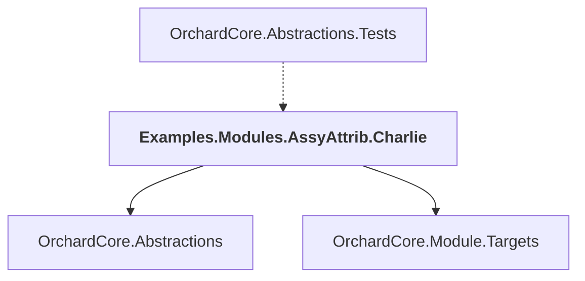

# Examples.Modules.AssyAttrib.Charlie

## Overview

| Property | Value |
|----------|-------|
| Category | Test |
| Repository | test |
| Path | `OrchardCore.Tests.Modules/Examples.Modules.AssyAttrib.Charlie/Examples.Modules.AssyAttrib.Charlie.csproj` |
| Project References | 2 |
| NuGet Dependencies | 0 |
| Consumers | 1 |

## Dependency Diagram

## Project References
- OrchardCore.Abstractions
- OrchardCore.Module.Targets

## Consumed By
- OrchardCore.Abstractions.Tests

---

*[Back to Index](../../index.md)*
