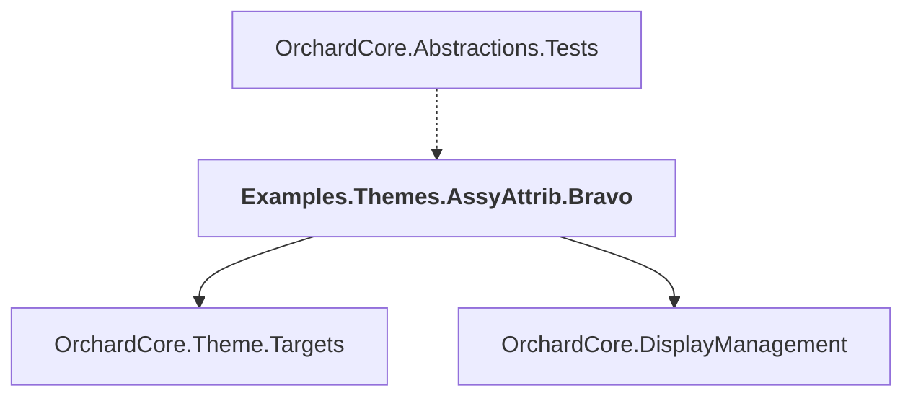

# Examples.Themes.AssyAttrib.Bravo

## Overview

| Property | Value |
|----------|-------|
| Category | Test |
| Repository | test |
| Path | `OrchardCore.Tests.Themes/Examples.Themes.AssyAttrib.Bravo/Examples.Themes.AssyAttrib.Bravo.csproj` |
| Project References | 2 |
| NuGet Dependencies | 0 |
| Consumers | 1 |

## Dependency Diagram

## Project References
- OrchardCore.Theme.Targets
- OrchardCore.DisplayManagement

## Consumed By
- OrchardCore.Abstractions.Tests

---

*[Back to Index](../../index.md)*
