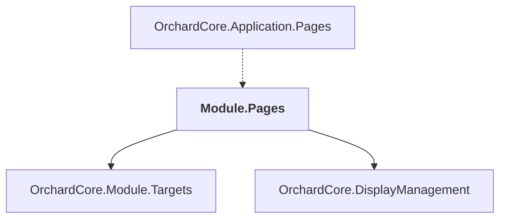

# Module.Pages

## Overview

| Property | Value |
|----------|-------|
| Category | Test |
| Repository | test |
| Path | `OrchardCore.Tests.Pages/OrchardCore.Modules.Pages/Module.Pages/Module.Pages.csproj` |
| Project References | 2 |
| NuGet Dependencies | 0 |
| Consumers | 1 |

## Dependency Diagram

## Project References
- OrchardCore.Module.Targets
- OrchardCore.DisplayManagement

## Consumed By
- OrchardCore.Application.Pages

---

*[Back to Index](../../index.md)*
