# OrchardCore.Abstractions.Tests

## Overview

| Property | Value |
|----------|-------|
| Category | Test |
| Repository | test |
| Path | `OrchardCore.Abstractions.Tests/OrchardCore.Abstractions.Tests.csproj` |
| Project References | 9 |
| NuGet Dependencies | 5 |
| Consumers | 0 |

## Dependency Diagram

```mermaid
graph TD
    OrchardCore_Abstractions_Tests["<strong>OrchardCore.Abstractions.Tests</strong>"]
    Examples_Features_AssyAttrib["Examples.Features.AssyAttrib"]
    OrchardCore_Abstractions_Tests --> Examples_Features_AssyAttrib
    Examples_Modules_AssyAttrib_Alpha["Examples.Modules.AssyAttrib.Alpha"]
    OrchardCore_Abstractions_Tests --> Examples_Modules_AssyAttrib_Alpha
    Examples_Modules_AssyAttrib_Bravo["Examples.Modules.AssyAttrib.Bravo"]
    OrchardCore_Abstractions_Tests --> Examples_Modules_AssyAttrib_Bravo
    Examples_Modules_AssyAttrib_Charlie["Examples.Modules.AssyAttrib.Charlie"]
    OrchardCore_Abstractions_Tests --> Examples_Modules_AssyAttrib_Charlie
    Examples_OrchardCoreModules_Alpha["Examples.OrchardCoreModules.Alpha"]
    OrchardCore_Abstractions_Tests --> Examples_OrchardCoreModules_Alpha
    Examples_Themes_AssyAttrib_Alpha["Examples.Themes.AssyAttrib.Alpha"]
    OrchardCore_Abstractions_Tests --> Examples_Themes_AssyAttrib_Alpha
    Examples_Themes_AssyAttrib_Bravo["Examples.Themes.AssyAttrib.Bravo"]
    OrchardCore_Abstractions_Tests --> Examples_Themes_AssyAttrib_Bravo
    Examples_Themes_AssyAttrib_Charlie["Examples.Themes.AssyAttrib.Charlie"]
    OrchardCore_Abstractions_Tests --> Examples_Themes_AssyAttrib_Charlie
    Examples_OrchardCoreThemes_Alpha["Examples.OrchardCoreThemes.Alpha"]
    OrchardCore_Abstractions_Tests --> Examples_OrchardCoreThemes_Alpha
```

## Project References
- Examples.Features.AssyAttrib
- Examples.Modules.AssyAttrib.Alpha
- Examples.Modules.AssyAttrib.Bravo
- Examples.Modules.AssyAttrib.Charlie
- Examples.OrchardCoreModules.Alpha
- Examples.Themes.AssyAttrib.Alpha
- Examples.Themes.AssyAttrib.Bravo
- Examples.Themes.AssyAttrib.Charlie
- Examples.OrchardCoreThemes.Alpha

## External NuGet Packages
| Package | Version |
|---------|---------||
| AngleSharp |  |
| Lorem.Universal.NET |  |
| Microsoft.AspNetCore.Mvc.Testing |  |
| Moq |  |
| xunit.v3.mtp-v2 |  |

---

*[Back to Index](../../index.md)*
