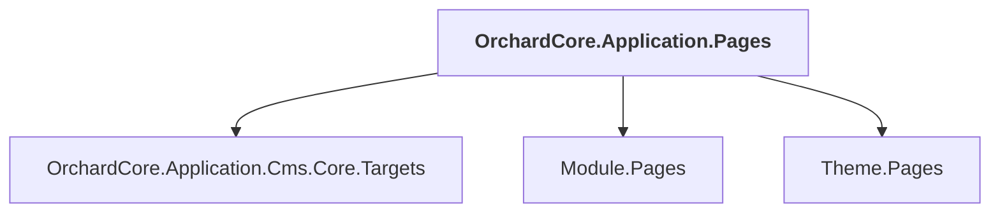

# OrchardCore.Application.Pages

## Overview

| Property | Value |
|----------|-------|
| Category | Test |
| Repository | test |
| Path | `OrchardCore.Tests.Pages/OrchardCore.Application.Pages/OrchardCore.Application.Pages.csproj` |
| Project References | 3 |
| NuGet Dependencies | 1 |
| Consumers | 0 |

## Dependency Diagram

## Project References
- OrchardCore.Application.Cms.Core.Targets
- Module.Pages
- Theme.Pages

## External NuGet Packages
| Package | Version |
|---------|---------||
| Microsoft.AspNetCore.Mvc.Razor.RuntimeCompilation |  |

---

*[Back to Index](../../index.md)*
