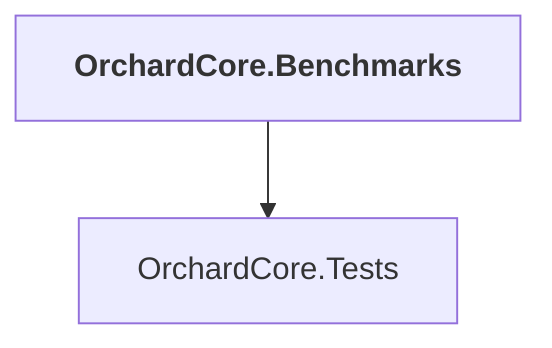

# OrchardCore.Benchmarks

## Overview

| Property | Value |
|----------|-------|
| Category | Application |
| Repository | test |
| Path | `OrchardCore.Benchmarks/OrchardCore.Benchmarks.csproj` |
| Project References | 1 |
| NuGet Dependencies | 1 |
| Consumers | 0 |

## Dependency Diagram

## Project References
- OrchardCore.Tests

## External NuGet Packages
| Package | Version |
|---------|---------||
| BenchmarkDotNet |  |

---

*[Back to Index](../../index.md)*
