# OrchardCore.Tests

## Overview

| Property | Value |
|----------|-------|
| Category | Test |
| Repository | test |
| Path | `OrchardCore.Tests/OrchardCore.Tests.csproj` |
| Project References | 9 |
| NuGet Dependencies | 4 |
| Consumers | 1 |

## Dependency Diagram

```mermaid
graph TD
    OrchardCore_Tests["<strong>OrchardCore.Tests</strong>"]
    OrchardCore_Cms_Web["OrchardCore.Cms.Web"]
    OrchardCore_Tests --> OrchardCore_Cms_Web
    OrchardCore_DynamicCache["OrchardCore.DynamicCache"]
    OrchardCore_Tests --> OrchardCore_DynamicCache
    OrchardCore_Apis_GraphQL_Abstractions["OrchardCore.Apis.GraphQL.Abstractions"]
    OrchardCore_Tests --> OrchardCore_Apis_GraphQL_Abstractions
    OrchardCore_Apis_GraphQL_Client["OrchardCore.Apis.GraphQL.Client"]
    OrchardCore_Tests --> OrchardCore_Apis_GraphQL_Client
    BaseThemeSample["BaseThemeSample"]
    OrchardCore_Tests --> BaseThemeSample
    BaseThemeSample2["BaseThemeSample2"]
    OrchardCore_Tests --> BaseThemeSample2
    DerivedThemeSample["DerivedThemeSample"]
    OrchardCore_Tests --> DerivedThemeSample
    DerivedThemeSample2["DerivedThemeSample2"]
    OrchardCore_Tests --> DerivedThemeSample2
    ModuleSample["ModuleSample"]
    OrchardCore_Tests --> ModuleSample
    OrchardCore_Benchmarks["OrchardCore.Benchmarks"]
    OrchardCore_Benchmarks -.-> OrchardCore_Tests
```

## Project References
- OrchardCore.Cms.Web
- OrchardCore.DynamicCache
- OrchardCore.Apis.GraphQL.Abstractions
- OrchardCore.Apis.GraphQL.Client
- BaseThemeSample
- BaseThemeSample2
- DerivedThemeSample
- DerivedThemeSample2
- ModuleSample

## Consumed By
- OrchardCore.Benchmarks

## External NuGet Packages
| Package | Version |
|---------|---------||
| AngleSharp |  |
| Microsoft.AspNetCore.Mvc.Testing |  |
| Moq |  |
| xunit.v3.mtp-v2 |  |

## Data Access Patterns
### Redis.Read
| File | Line | Context |
|------|------|---------||
| `test/OrchardCore.Tests/ContentManagement/ContentElementTests.cs` | 90 | `// Using 'dynamic' to bypass object retrieval from the cache when usin` |
| `test/OrchardCore.Tests/Modules/OrchardCore.Users/AccountControllerTests.cs` | 31 | `var responseFromGet = await context.Client.GetAsync("Register", TestCo` |
| `test/OrchardCore.Tests/Modules/OrchardCore.Users/AccountControllerTests.cs` | 170 | `var responseFromGet = await context.Client.GetAsync("Register", TestCo` |
| `test/OrchardCore.Tests/Modules/OrchardCore.Users/AccountControllerTests.cs` | 207 | `var response = await context.Client.GetAsync("Register", TestContext.C` |
| `test/OrchardCore.Tests/Modules/OrchardCore.Users/AccountControllerTests.cs` | 220 | `var response = await context.Client.GetAsync("Register", TestContext.C` |
| `test/OrchardCore.Tests/Modules/OrchardCore.Users/AccountControllerTests.cs` | 232 | `var responseFromGet = await context.Client.GetAsync("Register", TestCo` |
| `test/OrchardCore.Tests/Modules/OrchardCore.Users/AccountControllerTests.cs` | 251 | `var responseFromGet2 = await context.Client.GetAsync("Register", TestC` |
| `test/OrchardCore.Tests/Modules/OrchardCore.Users/AccountControllerTests.cs` | 277 | `var responseFromGet = await context.Client.GetAsync("Register", TestCo` |
| `test/OrchardCore.Tests/Modules/OrchardCore.Users/AccountControllerTests.cs` | 295 | `var responseFromGet2 = await context.Client.GetAsync("Register", TestC` |
| `test/OrchardCore.Tests/Modules/OrchardCore.Users/AccountControllerTests.cs` | 325 | `var responseFromGet = await context.Client.GetAsync("Register", TestCo` |
| `test/OrchardCore.Tests/Modules/OrchardCore.Users/AccountControllerTests.cs` | 365 | `var responseFromGet = await context.Client.GetAsync("Register", TestCo` |
| `test/OrchardCore.Tests/Modules/OrchardCore.OpenId/OpenIdAuthenticationTests.cs` | 92 | `var loginGetRequest = await httpClient.GetAsync("Login", CancellationT` |
| `test/OrchardCore.Tests/Modules/OrchardCore.OpenId/OpenIdAuthenticationTests.cs` | 252 | `var loginGetRequest = await httpClient.GetAsync("Login", CancellationT` |
| `test/OrchardCore.Tests/Modules/OrchardCore.Media/SecureMedia/ViewMediaFolderAuthorizationHandlerTests.cs` | 323 | `mockContentManager.Setup(cm => cm.GetAsync(It.IsAny<string>(), It.IsAn` |
| `test/OrchardCore.Tests/Modules/OrchardCore.Email/Workflows/EmailTaskTests.cs` | 70 | `resolver.Setup(x => x.GetAsync(It.IsAny<string>()))` |

*... and 19 more*

### Dapper.Execute
| File | Line | Context |
|------|------|---------||
| `test/OrchardCore.Tests/Commands/CommandManagerTests.cs` | 26 | `await _manager.ExecuteAsync(context);` |
| `test/OrchardCore.Tests/Commands/CommandManagerTests.cs` | 34 | `await _manager.ExecuteAsync(context);` |
| `test/OrchardCore.Tests/Commands/CommandHandlerTests.cs` | 48 | `await _handler.ExecuteAsync(commandContext);` |
| `test/OrchardCore.Tests/Commands/CommandHandlerTests.cs` | 58 | `await _handler.ExecuteAsync(commandContext);` |
| `test/OrchardCore.Tests/Commands/CommandHandlerTests.cs` | 66 | `await _handler.ExecuteAsync(commandContext);` |
| `test/OrchardCore.Tests/Commands/CommandHandlerTests.cs` | 88 | `await _handler.ExecuteAsync(commandContext);` |
| `test/OrchardCore.Tests/Commands/CommandHandlerTests.cs` | 96 | `await _handler.ExecuteAsync(commandContext);` |
| `test/OrchardCore.Tests/Commands/CommandHandlerTests.cs` | 104 | `await _handler.ExecuteAsync(commandContext);` |
| `test/OrchardCore.Tests/Commands/CommandHandlerTests.cs` | 112 | `await _handler.ExecuteAsync(commandContext);` |
| `test/OrchardCore.Tests/Commands/CommandHandlerTests.cs` | 121 | `await Assert.ThrowsAsync<InvalidOperationException>(async Task () => a` |
| `test/OrchardCore.Tests/Commands/CommandHandlerTests.cs` | 128 | `await _handler.ExecuteAsync(commandContext);` |
| `test/OrchardCore.Tests/Commands/CommandHandlerTests.cs` | 137 | `await Assert.ThrowsAsync<InvalidOperationException>(async Task () => a` |
| `test/OrchardCore.Tests/Commands/CommandHandlerTests.cs` | 144 | `await _handler.ExecuteAsync(commandContext);` |
| `test/OrchardCore.Tests/Commands/CommandHandlerTests.cs` | 152 | `await _handler.ExecuteAsync(commandContext);` |
| `test/OrchardCore.Tests/Commands/CommandHandlerTests.cs` | 160 | `await _handler.ExecuteAsync(commandContext);` |

*... and 67 more*

### HttpClient.New
| File | Line | Context |
|------|------|---------||
| `test/OrchardCore.Tests/Modules/OrchardCore.Resources/SubResourceIntegrityTests.cs` | 30 | `using var httpClient = new HttpClient();` |
| `test/OrchardCore.Tests/Modules/OrchardCore.Twitter/TwitterClientTests.cs` | 69 | `new HttpClient(_mockFakeHttpMessageHandler.Object), Mock.Of<ILogger<Tw` |

### Dapper.Query
| File | Line | Context |
|------|------|---------||
| `test/OrchardCore.Tests/Modules/OrchardCore.Users/AccountControllerTests.cs` | 96 | `var sam = await session.Query<User, UserByClaimIndex>()` |
| `test/OrchardCore.Tests/Modules/OrchardCore.Users/AccountControllerTests.cs` | 154 | `var userFromDb = await session.Query<User, UserByClaimIndex>()` |
| `test/OrchardCore.Tests/Modules/OrchardCore.OpenId/OpenIdAuthenticationTests.cs` | 75 | `var applications = await session.Query<OpenIdApplication, OpenIdApplic` |
| `test/OrchardCore.Tests/Modules/OrchardCore.OpenId/OpenIdAuthenticationTests.cs` | 233 | `var applications = await session.Query<OpenIdApplication, OpenIdApplic` |
| `test/OrchardCore.Tests/Data/Migration/DataMigrationManagerTests.cs` | 75 | `sessionMock.Setup(s => s.Query())` |
| `test/OrchardCore.Tests/Apis/ContentManagement/DeploymentPlans/ContentStepLuceneQueryTests.cs` | 42 | `.Query("RecentBlogPosts", builder =>` |
| `test/OrchardCore.Tests/Apis/ContentManagement/DeploymentPlans/BlogPostUpdateDeploymentPlanTests.cs` | 30 | `var blogPosts = await session.Query<ContentItem, ContentItemIndex>(x =` |
| `test/OrchardCore.Tests/Apis/ContentManagement/DeploymentPlans/BlogPostUpdateDeploymentPlanTests.cs` | 62 | `var blogPosts = await session.Query<ContentItem, ContentItemIndex>(x =` |
| `test/OrchardCore.Tests/Apis/ContentManagement/DeploymentPlans/BlogPostUpdateDeploymentPlanTests.cs` | 102 | `var blogPosts = await session.Query<ContentItem, ContentItemIndex>(x =` |
| `test/OrchardCore.Tests/Apis/ContentManagement/DeploymentPlans/BlogPostCreateDeploymentPlanTests.cs` | 33 | `var blogPosts = await session.Query<ContentItem, ContentItemIndex>(x =` |
| `test/OrchardCore.Tests/Apis/ContentManagement/DeploymentPlans/BlogPostCreateDeploymentPlanTests.cs` | 73 | `var blogPosts = await session.Query<ContentItem, ContentItemIndex>(x =` |
| `test/OrchardCore.Tests/Apis/ContentManagement/DeploymentPlans/BlogPostCreateDeploymentPlanTests.cs` | 117 | `var blogPosts = await session.Query<ContentItem, ContentItemIndex>(x =` |
| `test/OrchardCore.Tests/Apis/ContentManagement/DeploymentPlans/BlogPostCreateDeploymentPlanTests.cs` | 160 | `var blogPostsCount = await session.Query<ContentItem, ContentItemIndex` |
| `test/OrchardCore.Tests/Apis/ContentManagement/DeploymentPlans/BlogPostCreateDeploymentPlanTests.cs` | 204 | `var blogPostsCount = await session.Query<ContentItem, ContentItemIndex` |
| `test/OrchardCore.Tests/Apis/ContentManagement/DeploymentPlans/BlogPostContentStepIdempotentTests.cs` | 33 | `var blogPosts = await session.Query<ContentItem, ContentItemIndex>(x =` |

*... and 29 more*

### HttpClient.GetAsync
| File | Line | Context |
|------|------|---------||
| `test/OrchardCore.Tests/Modules/OrchardCore.Users/AccountControllerTests.cs` | 31 | `var responseFromGet = await context.Client.GetAsync("Register", TestCo` |
| `test/OrchardCore.Tests/Modules/OrchardCore.Users/AccountControllerTests.cs` | 170 | `var responseFromGet = await context.Client.GetAsync("Register", TestCo` |
| `test/OrchardCore.Tests/Modules/OrchardCore.Users/AccountControllerTests.cs` | 207 | `var response = await context.Client.GetAsync("Register", TestContext.C` |
| `test/OrchardCore.Tests/Modules/OrchardCore.Users/AccountControllerTests.cs` | 220 | `var response = await context.Client.GetAsync("Register", TestContext.C` |
| `test/OrchardCore.Tests/Modules/OrchardCore.Users/AccountControllerTests.cs` | 232 | `var responseFromGet = await context.Client.GetAsync("Register", TestCo` |
| `test/OrchardCore.Tests/Modules/OrchardCore.Users/AccountControllerTests.cs` | 251 | `var responseFromGet2 = await context.Client.GetAsync("Register", TestC` |
| `test/OrchardCore.Tests/Modules/OrchardCore.Users/AccountControllerTests.cs` | 277 | `var responseFromGet = await context.Client.GetAsync("Register", TestCo` |
| `test/OrchardCore.Tests/Modules/OrchardCore.Users/AccountControllerTests.cs` | 295 | `var responseFromGet2 = await context.Client.GetAsync("Register", TestC` |
| `test/OrchardCore.Tests/Modules/OrchardCore.Users/AccountControllerTests.cs` | 325 | `var responseFromGet = await context.Client.GetAsync("Register", TestCo` |
| `test/OrchardCore.Tests/Modules/OrchardCore.Users/AccountControllerTests.cs` | 365 | `var responseFromGet = await context.Client.GetAsync("Register", TestCo` |
| `test/OrchardCore.Tests/Modules/OrchardCore.OpenId/OpenIdAuthenticationTests.cs` | 92 | `var loginGetRequest = await httpClient.GetAsync("Login", CancellationT` |
| `test/OrchardCore.Tests/Modules/OrchardCore.OpenId/OpenIdAuthenticationTests.cs` | 252 | `var loginGetRequest = await httpClient.GetAsync("Login", CancellationT` |
| `test/OrchardCore.Tests/Apis/GraphQL/Blog/BlogPostTests.cs` | 210 | `var response = await context.GraphQLClient.Client.GetAsync("api/graphq` |

### Redis.Write
| File | Line | Context |
|------|------|---------||
| `test/OrchardCore.Tests/Modules/OrchardCore.Tenants/ApiControllerTests.cs` | 190 | `httpContext.Features.Set(new ShellContextFeature` |
| `test/OrchardCore.Tests/Shell/ShellScopeTests.cs` | 23 | `waitHandle.Set();` |

### File.Read
| File | Line | Context |
|------|------|---------||
| `test/OrchardCore.Tests/Email/EmailTests.cs` | 271 | `var content = File.ReadAllText(file.FullName);` |

### SQL.Select
| File | Line | Context |
|------|------|---------||
| `test/OrchardCore.Tests/Orchard.Queries/SqlParserTests.cs` | 49 | `[InlineData("select a from t", "SELECT [a] FROM [tp_t];")]` |
| `test/OrchardCore.Tests/Orchard.Queries/SqlParserTests.cs` | 50 | `[InlineData("SELECT a FROM t", "SELECT [a] FROM [tp_t];")]` |
| `test/OrchardCore.Tests/Orchard.Queries/SqlParserTests.cs` | 51 | `[InlineData("SELECT a FROM t as t1", "SELECT [a] FROM [tp_t] AS t1;")]` |
| `test/OrchardCore.Tests/Orchard.Queries/SqlParserTests.cs` | 52 | `[InlineData("SELECT a FROM t1, t2", "SELECT [a] FROM [tp_t1], [tp_t2];` |
| `test/OrchardCore.Tests/Orchard.Queries/SqlParserTests.cs` | 93 | `[InlineData("select a where b = (select Avg(c) from d)", "SELECT [a] W` |
| `test/OrchardCore.Tests/Orchard.Queries/SqlParserTests.cs` | 123 | `[InlineData("select a from b inner join c on b.b1 = c.c1", "SELECT [a]` |
| `test/OrchardCore.Tests/Orchard.Queries/SqlParserTests.cs` | 124 | `[InlineData("select a from b as ba inner join c as ca on ba.b1 = ca.c1` |
| `test/OrchardCore.Tests/Orchard.Queries/SqlParserTests.cs` | 125 | `[InlineData("select a from b inner join c on b.b1 = c.c1 left join d o` |
| `test/OrchardCore.Tests/Orchard.Queries/SqlParserTests.cs` | 126 | `[InlineData("select a from b inner join c on b.b1 = c.c1 and b.b2 = c.` |
| `test/OrchardCore.Tests/Orchard.Queries/SqlParserTests.cs` | 127 | `[InlineData("select a from b inner join c on b.b1 = c.c1 and b.b2 = @p` |
| `test/OrchardCore.Tests/Orchard.Queries/SqlParserTests.cs` | 128 | `[InlineData("select a from b inner join c on 1 = 1 and @param = 'foo'"` |
| `test/OrchardCore.Tests/Orchard.Queries/SqlParserTests.cs` | 129 | `[InlineData("select a from b inner join c on 1 = @param left join d on` |
| `test/OrchardCore.Tests/Orchard.Queries/SqlParserTests.cs` | 141 | `[InlineData("select a from b as b1 order by b1.c", "SELECT [a] FROM [t` |
| `test/OrchardCore.Tests/Orchard.Queries/SqlParserTests.cs` | 166 | `[InlineData("select count(a) from b as b1 group by b1.c", "SELECT coun` |
| `test/OrchardCore.Tests/Orchard.Queries/SqlParserTests.cs` | 199 | `[InlineData("select COUNT(1) over () from a", "SELECT COUNT(1) OVER ()` |

*... and 26 more*

### HttpClient.PostAsync
| File | Line | Context |
|------|------|---------||
| `test/OrchardCore.Tests/Apis/ContentManagement/DeploymentPlans/BlogPostUpdateDeploymentPlanTests.cs` | 47 | `var content = await context.Client.PostAsJsonAsync("api/content?draft=` |
| `test/OrchardCore.Tests/Apis/ContentManagement/DeploymentPlans/BlogPostUpdateDeploymentPlanTests.cs` | 85 | `var content = await context.Client.PostAsJsonAsync("api/content?draft=` |
| `test/OrchardCore.Tests/Apis/ContentManagement/DeploymentPlans/BlogPostCreateDeploymentPlanTests.cs` | 57 | `var content = await context.Client.PostAsJsonAsync("api/content?draft=` |
| `test/OrchardCore.Tests/Apis/ContentManagement/DeploymentPlans/BlogPostCreateDeploymentPlanTests.cs` | 100 | `var content = await context.Client.PostAsJsonAsync("api/content?draft=` |
| `test/OrchardCore.Tests/Apis/ContentManagement/ContentApiController/BlogPostApiControllerTests.cs` | 25 | `var content = await context.Client.PostAsJsonAsync("api/content?draft=` |
| `test/OrchardCore.Tests/Apis/ContentManagement/ContentApiController/BlogPostApiControllerTests.cs` | 45 | `var content = await context.Client.PostAsJsonAsync("api/content", cont` |
| `test/OrchardCore.Tests/Apis/ContentManagement/ContentApiController/BlogPostApiControllerTests.cs` | 65 | `await context.Client.PostAsJsonAsync("api/content", context.BlogPost);` |
| `test/OrchardCore.Tests/Apis/ContentManagement/ContentApiController/BlogPostApiControllerTests.cs` | 124 | `var content = await context.Client.PostAsJsonAsync("api/content?draft=` |
| `test/OrchardCore.Tests/Apis/ContentManagement/ContentApiController/BlogPostApiControllerTests.cs` | 181 | `var content = await context.Client.PostAsJsonAsync("api/content", cont` |
| `test/OrchardCore.Tests/Apis/ContentManagement/ContentApiController/BlogPostApiControllerTests.cs` | 236 | `var result = await context.Client.PostAsJsonAsync("api/content", conte` |
| `test/OrchardCore.Tests/Apis/ContentManagement/ContentApiController/BlogPostApiControllerTests.cs` | 292 | `var content = await context.Client.PostAsJsonAsync("api/content", cont` |
| `test/OrchardCore.Tests/Apis/Context/BlogPostDeploymentContext.cs` | 89 | `var response = await Client.PostAsync("OrchardCore.Deployment.Remote/I` |
| `test/OrchardCore.Tests/Apis/Context/SiteContext.cs` | 58 | `var createResult = await DefaultTenantClient.PostAsJsonAsync("api/tena` |
| `test/OrchardCore.Tests/Apis/Context/SiteContext.cs` | 79 | `var setupResult = await DefaultTenantClient.PostAsJsonAsync("api/tenan` |
| `test/OrchardCore.Tests/Apis/Context/SiteContext.cs` | 188 | `var content = await Client.PostAsJsonAsync("api/content" + (draft ? "?` |

### ConnectionString
| File | Line | Context |
|------|------|---------||
| `test/OrchardCore.Tests/Apis/GraphQL/ContentItemsFieldTypeTests.cs` | 34 | `var connectionStringTemplate = @"Data Source={0};Cache=Shared";` |
| `test/OrchardCore.Tests/Apis/GraphQL/ContentItemsFieldTypeTests.cs` | 37 | `_store = await StoreFactory.CreateAndInitializeAsync(new Configuration` |
| `test/OrchardCore.Tests/Apis/GraphQL/ContentItemsFieldTypeTests.cs` | 40 | `_prefixedStore = await StoreFactory.CreateAndInitializeAsync(new Confi` |
| `test/OrchardCore.Tests/Apis/Context/SiteContext.cs` | 26 | `public string ConnectionString { get; set; }` |
| `test/OrchardCore.Tests/Apis/Context/SiteContext.cs` | 51 | `ConnectionString = ConnectionString,` |
| `test/OrchardCore.Tests/Apis/Context/SiteContext.cs` | 71 | `ConnectionString = ConnectionString,` |
| `test/OrchardCore.Tests/Apis/Context/SiteContext.cs` | 215 | `public static T WithConnectionString<T>(this T siteContext, string con` |
| `test/OrchardCore.Tests/Apis/Context/SiteContext.cs` | 217 | `siteContext.ConnectionString = connectionString;` |

### EntityFramework
| File | Line | Context |
|------|------|---------||
| `test/OrchardCore.Tests/Apis/GraphQL/Queries/PredicateQueryTests.cs` | 17 | `.UseSqlServer("Fake database connection string for testing;", "TenantS` |
| `test/OrchardCore.Tests/Apis/GraphQL/Queries/PredicateQueryTests.cs` | 86 | `.UseMySql("Fake database connection string for testing;", "TenantSchem` |
| `test/OrchardCore.Tests/Apis/GraphQL/Queries/PredicateQueryTests.cs` | 98 | `.UseSqlServer("Fake database connection string for testing;", "TenantS` |

### HttpClient.DeleteAsync
| File | Line | Context |
|------|------|---------||
| `test/OrchardCore.Tests/Apis/Context/SiteContext.cs` | 196 | `return Client.DeleteAsync("api/content/" + contentItemId);` |

---

*[Back to Index](../../index.md)*
