# OrchardCore.Tests

## Overview

| Property | Value |
|----------|-------|
| Category | Test |
| Repository | test |
| Path | `OrchardCore.Tests/OrchardCore.Tests.csproj` |
| Project References | 9 |
| NuGet Dependencies | 4 |
| Consumers | 1 |

## Dependency Diagram

```mermaid
graph TD
    OrchardCore_Tests["<strong>OrchardCore.Tests</strong>"]
    OrchardCore_Cms_Web["OrchardCore.Cms.Web"]
    OrchardCore_Tests --> OrchardCore_Cms_Web
    OrchardCore_DynamicCache["OrchardCore.DynamicCache"]
    OrchardCore_Tests --> OrchardCore_DynamicCache
    OrchardCore_Apis_GraphQL_Abstractions["OrchardCore.Apis.GraphQL.Abstractions"]
    OrchardCore_Tests --> OrchardCore_Apis_GraphQL_Abstractions
    OrchardCore_Apis_GraphQL_Client["OrchardCore.Apis.GraphQL.Client"]
    OrchardCore_Tests --> OrchardCore_Apis_GraphQL_Client
    BaseThemeSample["BaseThemeSample"]
    OrchardCore_Tests --> BaseThemeSample
    BaseThemeSample2["BaseThemeSample2"]
    OrchardCore_Tests --> BaseThemeSample2
    DerivedThemeSample["DerivedThemeSample"]
    OrchardCore_Tests --> DerivedThemeSample
    DerivedThemeSample2["DerivedThemeSample2"]
    OrchardCore_Tests --> DerivedThemeSample2
    ModuleSample["ModuleSample"]
    OrchardCore_Tests --> ModuleSample
    OrchardCore_Benchmarks["OrchardCore.Benchmarks"]
    OrchardCore_Benchmarks -.-> OrchardCore_Tests
```

## Project References
- OrchardCore.Cms.Web
- OrchardCore.DynamicCache
- OrchardCore.Apis.GraphQL.Abstractions
- OrchardCore.Apis.GraphQL.Client
- BaseThemeSample
- BaseThemeSample2
- DerivedThemeSample
- DerivedThemeSample2
- ModuleSample

## Consumed By
- OrchardCore.Benchmarks

## External NuGet Packages
| Package | Version |
|---------|---------||
| AngleSharp |  |
| Microsoft.AspNetCore.Mvc.Testing |  |
| Moq |  |
| xunit.v3.mtp-v2 |  |

## Data Access Patterns
### HttpClient.New
| File | Line | Context |
|------|------|---------||
| `test/OrchardCore.Tests/Modules/OrchardCore.Resources/SubResourceIntegrityTests.cs` | 30 | `using var httpClient = new HttpClient();` |
| `test/OrchardCore.Tests/Modules/OrchardCore.Twitter/TwitterClientTests.cs` | 69 | `new HttpClient(_mockFakeHttpMessageHandler.Object), Mock.Of<ILogger<Tw` |

### Dapper
| File | Line | Context |
|------|------|---------||
| `test/OrchardCore.Tests/Modules/OrchardCore.Users/AccountControllerTests.cs` | 96 | `var sam = await session.Query<User, UserByClaimIndex>()` |
| `test/OrchardCore.Tests/Modules/OrchardCore.Users/AccountControllerTests.cs` | 154 | `var userFromDb = await session.Query<User, UserByClaimIndex>()` |
| `test/OrchardCore.Tests/Modules/OrchardCore.OpenId/OpenIdAuthenticationTests.cs` | 75 | `var applications = await session.Query<OpenIdApplication, OpenIdApplic` |
| `test/OrchardCore.Tests/Modules/OrchardCore.OpenId/OpenIdAuthenticationTests.cs` | 233 | `var applications = await session.Query<OpenIdApplication, OpenIdApplic` |
| `test/OrchardCore.Tests/Data/Migration/DataMigrationManagerTests.cs` | 75 | `sessionMock.Setup(s => s.Query())` |
| `test/OrchardCore.Tests/Apis/ContentManagement/DeploymentPlans/ContentStepLuceneQueryTests.cs` | 42 | `.Query("RecentBlogPosts", builder =>` |
| `test/OrchardCore.Tests/Apis/ContentManagement/DeploymentPlans/BlogPostUpdateDeploymentPlanTests.cs` | 30 | `var blogPosts = await session.Query<ContentItem, ContentItemIndex>(x =` |
| `test/OrchardCore.Tests/Apis/ContentManagement/DeploymentPlans/BlogPostUpdateDeploymentPlanTests.cs` | 62 | `var blogPosts = await session.Query<ContentItem, ContentItemIndex>(x =` |
| `test/OrchardCore.Tests/Apis/ContentManagement/DeploymentPlans/BlogPostUpdateDeploymentPlanTests.cs` | 102 | `var blogPosts = await session.Query<ContentItem, ContentItemIndex>(x =` |
| `test/OrchardCore.Tests/Apis/ContentManagement/DeploymentPlans/BlogPostCreateDeploymentPlanTests.cs` | 33 | `var blogPosts = await session.Query<ContentItem, ContentItemIndex>(x =` |
| `test/OrchardCore.Tests/Apis/ContentManagement/DeploymentPlans/BlogPostCreateDeploymentPlanTests.cs` | 73 | `var blogPosts = await session.Query<ContentItem, ContentItemIndex>(x =` |
| `test/OrchardCore.Tests/Apis/ContentManagement/DeploymentPlans/BlogPostCreateDeploymentPlanTests.cs` | 117 | `var blogPosts = await session.Query<ContentItem, ContentItemIndex>(x =` |
| `test/OrchardCore.Tests/Apis/ContentManagement/DeploymentPlans/BlogPostCreateDeploymentPlanTests.cs` | 160 | `var blogPostsCount = await session.Query<ContentItem, ContentItemIndex` |
| `test/OrchardCore.Tests/Apis/ContentManagement/DeploymentPlans/BlogPostCreateDeploymentPlanTests.cs` | 204 | `var blogPostsCount = await session.Query<ContentItem, ContentItemIndex` |
| `test/OrchardCore.Tests/Apis/ContentManagement/DeploymentPlans/BlogPostContentStepIdempotentTests.cs` | 33 | `var blogPosts = await session.Query<ContentItem, ContentItemIndex>(x =` |

*... and 29 more*

### ConnectionString
| File | Line | Context |
|------|------|---------||
| `test/OrchardCore.Tests/Apis/GraphQL/ContentItemsFieldTypeTests.cs` | 34 | `var connectionStringTemplate = @"Data Source={0};Cache=Shared";` |
| `test/OrchardCore.Tests/Apis/GraphQL/ContentItemsFieldTypeTests.cs` | 37 | `_store = await StoreFactory.CreateAndInitializeAsync(new Configuration` |
| `test/OrchardCore.Tests/Apis/GraphQL/ContentItemsFieldTypeTests.cs` | 40 | `_prefixedStore = await StoreFactory.CreateAndInitializeAsync(new Confi` |
| `test/OrchardCore.Tests/Apis/Context/SiteContext.cs` | 26 | `public string ConnectionString { get; set; }` |
| `test/OrchardCore.Tests/Apis/Context/SiteContext.cs` | 51 | `ConnectionString = ConnectionString,` |
| `test/OrchardCore.Tests/Apis/Context/SiteContext.cs` | 71 | `ConnectionString = ConnectionString,` |
| `test/OrchardCore.Tests/Apis/Context/SiteContext.cs` | 215 | `public static T WithConnectionString<T>(this T siteContext, string con` |
| `test/OrchardCore.Tests/Apis/Context/SiteContext.cs` | 217 | `siteContext.ConnectionString = connectionString;` |

### EntityFramework
| File | Line | Context |
|------|------|---------||
| `test/OrchardCore.Tests/Apis/GraphQL/Queries/PredicateQueryTests.cs` | 17 | `.UseSqlServer("Fake database connection string for testing;", "TenantS` |
| `test/OrchardCore.Tests/Apis/GraphQL/Queries/PredicateQueryTests.cs` | 86 | `.UseMySql("Fake database connection string for testing;", "TenantSchem` |
| `test/OrchardCore.Tests/Apis/GraphQL/Queries/PredicateQueryTests.cs` | 98 | `.UseSqlServer("Fake database connection string for testing;", "TenantS` |

---

*[Back to Index](../../index.md)*
