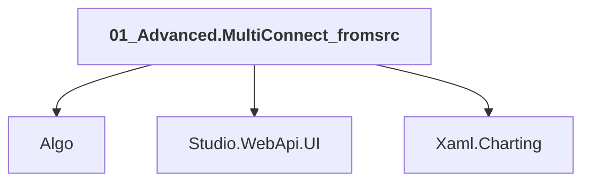

# 01_Advanced.MultiConnect_fromsrc

## Overview

| Property | Value |
|----------|-------|
| Category | Sample |
| Repository | StockSharp |
| Path | `Samples/09_Advanced/01_MultiConnect/01_Advanced.MultiConnect_fromsrc.csproj` |
| Project References | 3 |
| NuGet Dependencies | 0 |
| Consumers | 0 |

## Dependency Diagram

## Project References
- Algo
- Studio.WebApi.UI
- Xaml.Charting

---

*[Back to Index](../index.md)*
