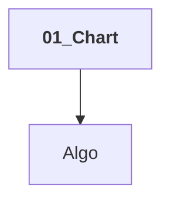

# 01_Chart

## Overview

| Property | Value |
|----------|-------|
| Category | Sample |
| Repository | StockSharp |
| Path | `Samples/05_Chart/01_Chart/01_Chart.csproj` |
| Project References | 1 |
| NuGet Dependencies | 3 |
| Consumers | 0 |

## Dependency Diagram

## Project References
- Algo

## Internal NuGet Packages
| Package | Version |
|---------|---------|
| Ecng.Compilation.Roslyn | 1.0.* |
| StockSharp.Xaml.Charting | 5.* |
| StockSharp.Samples.HistoryData | 5.* |

---

*[Back to Index](../index.md)*
