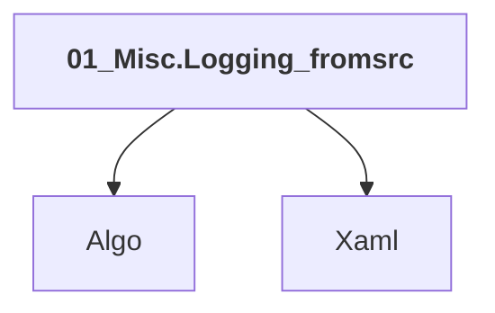

# 01_Misc.Logging_fromsrc

## Overview

| Property | Value |
|----------|-------|
| Category | Sample |
| Repository | StockSharp |
| Path | `Samples/08_Misc/01_Logging/01_Misc.Logging_fromsrc.csproj` |
| Project References | 2 |
| NuGet Dependencies | 0 |
| Consumers | 0 |

## Dependency Diagram

## Project References
- Algo
- Xaml

---

*[Back to Index](../index.md)*
