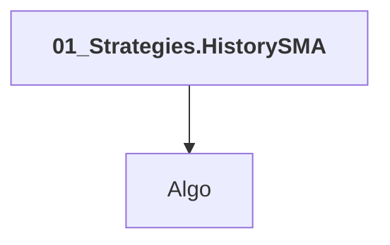

# 01_Strategies.HistorySMA

## Overview

| Property | Value |
|----------|-------|
| Category | Sample |
| Repository | StockSharp |
| Path | `Samples/06_Strategies/01_HistorySMA/01_Strategies.HistorySMA.csproj` |
| Project References | 1 |
| NuGet Dependencies | 2 |
| Consumers | 0 |

## Dependency Diagram

## Project References
- Algo

## Internal NuGet Packages
| Package | Version |
|---------|---------|
| StockSharp.Xaml.Charting | 5.* |
| StockSharp.Samples.HistoryData | 5.* |

---

*[Back to Index](../index.md)*
