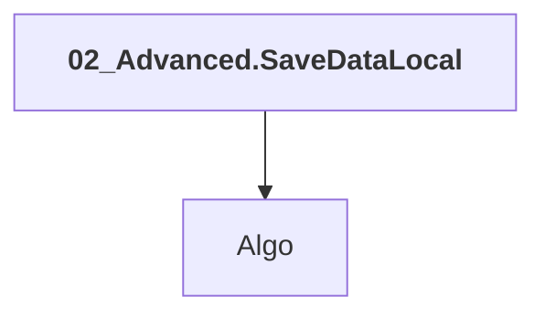

# 02_Advanced.SaveDataLocal

## Overview

| Property | Value |
|----------|-------|
| Category | Sample |
| Repository | StockSharp |
| Path | `Samples/09_Advanced/02_StoreDataLocal/02_Advanced.SaveDataLocal.csproj` |
| Project References | 1 |
| NuGet Dependencies | 7 |
| Consumers | 0 |

## Dependency Diagram

## Project References
- Algo

## Internal NuGet Packages
| Package | Version |
|---------|---------|
| StockSharp.Binance | 5.* |
| StockSharp.Okex | 5.* |
| StockSharp.GateIO | 5.* |
| StockSharp.Bitmex | 5.* |
| StockSharp.Fix | 5.* |
| StockSharp.Xaml.Charting | 5.* |
| StockSharp.Studio.WebApi.UI | 5.* |

---

*[Back to Index](../index.md)*
