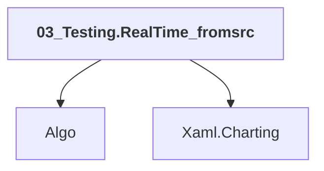

# 03_Testing.RealTime_fromsrc

## Overview

| Property | Value |
|----------|-------|
| Category | Test |
| Repository | StockSharp |
| Path | `Samples/07_Testing/03_RealTime/03_Testing.RealTime_fromsrc.csproj` |
| Project References | 2 |
| NuGet Dependencies | 0 |
| Consumers | 0 |

## Dependency Diagram

## Project References
- Algo
- Xaml.Charting

---

*[Back to Index](../index.md)*
