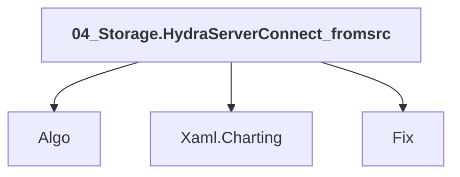

# 04_Storage.HydraServerConnect_fromsrc

## Overview

| Property | Value |
|----------|-------|
| Category | Sample |
| Repository | StockSharp |
| Path | `Samples/03_Storage/04_HydraServerConnect/04_Storage.HydraServerConnect_fromsrc.csproj` |
| Project References | 3 |
| NuGet Dependencies | 0 |
| Consumers | 0 |

## Dependency Diagram

## Project References
- Algo
- Xaml.Charting
- Fix

---

*[Back to Index](../index.md)*
