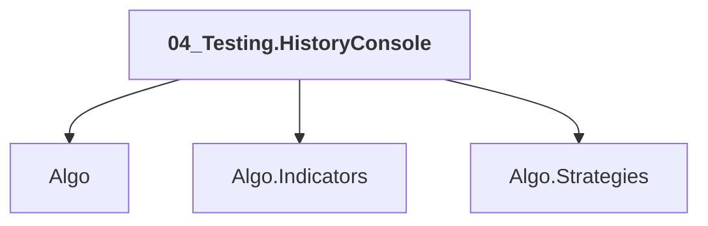

# 04_Testing.HistoryConsole

## Overview

| Property | Value |
|----------|-------|
| Category | Test |
| Repository | StockSharp |
| Path | `Samples/07_Testing/04_HistoryConsole/04_Testing.HistoryConsole.csproj` |
| Project References | 3 |
| NuGet Dependencies | 2 |
| Consumers | 0 |

## Dependency Diagram

## Project References
- Algo
- Algo.Indicators
- Algo.Strategies

## Internal NuGet Packages
| Package | Version |
|---------|---------|
| Ecng.Excel.OpenXml | 1.0.* |
| StockSharp.Samples.HistoryData | 5.* |

---

*[Back to Index](../index.md)*
