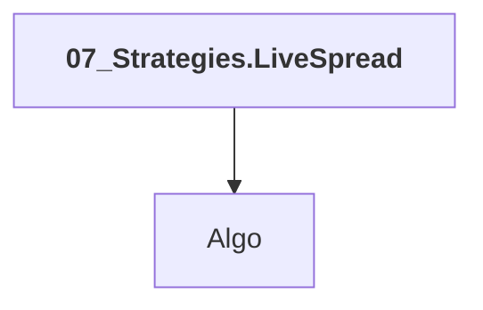

# 07_Strategies.LiveSpread

## Overview

| Property | Value |
|----------|-------|
| Category | Sample |
| Repository | StockSharp |
| Path | `Samples/06_Strategies/07_LiveSpread/07_Strategies.LiveSpread.csproj` |
| Project References | 1 |
| NuGet Dependencies | 6 |
| Consumers | 0 |

## Dependency Diagram

## Project References
- Algo

## Internal NuGet Packages
| Package | Version |
|---------|---------|
| StockSharp.Binance | 5.* |
| StockSharp.Okex | 5.* |
| StockSharp.GateIO | 5.* |
| StockSharp.Bitmex | 5.* |
| StockSharp.Fix | 5.* |
| StockSharp.Xaml | 5.* |

---

*[Back to Index](../index.md)*
