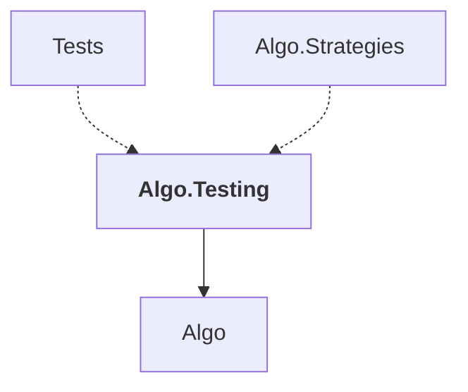

# Algo.Testing

## Overview

| Property | Value |
|----------|-------|
| Category | Test |
| Repository | StockSharp |
| Path | `Algo.Testing/Algo.Testing.csproj` |
| Project References | 1 |
| NuGet Dependencies | 0 |
| Consumers | 2 |

## Dependency Diagram

## Project References
- Algo

## Consumed By
- Tests
- Algo.Strategies

## Data Access Patterns
### IMessageAdapter
| File | Line | Context |
|------|------|---------||
| `Algo.Testing/EmulationMessageAdapter.cs` | 9 | `public class EmulationMessageAdapter : MessageAdapterWrapper, IEmulati` |
| `Algo.Testing/HistoryMessageAdapter.cs` | 10 | `public class HistoryMessageAdapter : MessageAdapter, IEmulationMessage` |
| `Algo.Testing/MarketEmulatorAdapter.cs` | 6 | `public class MarketEmulatorAdapter : MessageAdapter` |

---

*[Back to Index](../index.md)*
