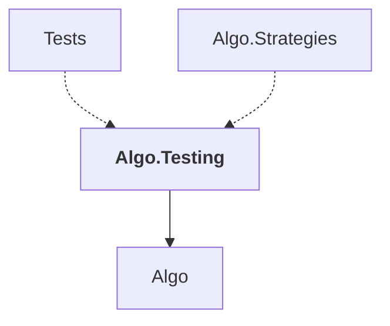

# Algo.Testing

## Overview

| Property | Value |
|----------|-------|
| Category | Test |
| Repository | StockSharp |
| Path | `Algo.Testing/Algo.Testing.csproj` |
| Project References | 1 |
| NuGet Dependencies | 0 |
| Consumers | 2 |

## Dependency Diagram

## Project References
- Algo

## Consumed By
- Tests
- Algo.Strategies

## Data Access Patterns
### IMessageAdapter
| File | Line | Context |
|------|------|---------||
| `Algo.Testing/EmulationMessageAdapter.cs` | 9 | `public class EmulationMessageAdapter : MessageAdapterWrapper, IEmulati` |
| `Algo.Testing/HistoryMessageAdapter.cs` | 10 | `public class HistoryMessageAdapter : MessageAdapter, IEmulationMessage` |
| `Algo.Testing/MarketEmulatorAdapter.cs` | 6 | `public class MarketEmulatorAdapter : MessageAdapter` |

### Redis.Write
| File | Line | Context |
|------|------|---------||
| `Algo.Testing/MarketEmulatorSettings.cs` | 475 | `.Set(nameof(CandlePrice), CandlePrice)` |
| `Algo.Testing/MarketEmulatorSettings.cs` | 476 | `.Set(nameof(MatchOnTouch), MatchOnTouch)` |
| `Algo.Testing/MarketEmulatorSettings.cs` | 477 | `.Set(nameof(Failing), Failing)` |
| `Algo.Testing/MarketEmulatorSettings.cs` | 478 | `.Set(nameof(Latency), Latency)` |
| `Algo.Testing/MarketEmulatorSettings.cs` | 479 | `.Set(nameof(InitialOrderId), InitialOrderId)` |
| `Algo.Testing/MarketEmulatorSettings.cs` | 480 | `.Set(nameof(InitialTradeId), InitialTradeId)` |
| `Algo.Testing/MarketEmulatorSettings.cs` | 481 | `.Set(nameof(SpreadSize), SpreadSize)` |
| `Algo.Testing/MarketEmulatorSettings.cs` | 482 | `.Set(nameof(MaxDepth), MaxDepth)` |
| `Algo.Testing/MarketEmulatorSettings.cs` | 483 | `.Set(nameof(PortfolioRecalcInterval), PortfolioRecalcInterval)` |
| `Algo.Testing/MarketEmulatorSettings.cs` | 484 | `.Set(nameof(ConvertTime), ConvertTime)` |
| `Algo.Testing/MarketEmulatorSettings.cs` | 485 | `.Set(nameof(PriceLimitOffset), PriceLimitOffset)` |
| `Algo.Testing/MarketEmulatorSettings.cs` | 486 | `.Set(nameof(IncreaseDepthVolume), IncreaseDepthVolume)` |
| `Algo.Testing/MarketEmulatorSettings.cs` | 487 | `.Set(nameof(CheckTradingState), CheckTradingState)` |
| `Algo.Testing/MarketEmulatorSettings.cs` | 488 | `.Set(nameof(CheckMoney), CheckMoney)` |
| `Algo.Testing/MarketEmulatorSettings.cs` | 489 | `.Set(nameof(CheckShortable), CheckShortable)` |

*... and 7 more*

---

*[Back to Index](../index.md)*
