# Localization.all

## Overview

| Property | Value |
|----------|-------|
| Category | Localization |
| Repository | StockSharp |
| Path | `Localization.Langs/all/Localization.all.csproj` |
| Project References | 38 |
| NuGet Dependencies | 0 |
| Consumers | 0 |

## Dependency Diagram

```mermaid
graph TD
    Localization_all["<strong>Localization.all</strong>"]
    Localization_ar["Localization.ar"]
    Localization_all --> Localization_ar
    Localization_bn["Localization.bn"]
    Localization_all --> Localization_bn
    Localization_ca["Localization.ca"]
    Localization_all --> Localization_ca
    Localization_cs["Localization.cs"]
    Localization_all --> Localization_cs
    Localization_da["Localization.da"]
    Localization_all --> Localization_da
    Localization_de["Localization.de"]
    Localization_all --> Localization_de
    Localization_el["Localization.el"]
    Localization_all --> Localization_el
    Localization_es["Localization.es"]
    Localization_all --> Localization_es
    Localization_fa["Localization.fa"]
    Localization_all --> Localization_fa
    Localization_fi["Localization.fi"]
    Localization_all --> Localization_fi
    Localization_fr["Localization.fr"]
    Localization_all --> Localization_fr
    Localization_he["Localization.he"]
    Localization_all --> Localization_he
    Localization_hi["Localization.hi"]
    Localization_all --> Localization_hi
    Localization_hu["Localization.hu"]
    Localization_all --> Localization_hu
    Localization_it["Localization.it"]
    Localization_all --> Localization_it
    Localization_ja["Localization.ja"]
    Localization_all --> Localization_ja
    Localization_jv["Localization.jv"]
    Localization_all --> Localization_jv
    Localization_ko["Localization.ko"]
    Localization_all --> Localization_ko
    Localization_ms["Localization.ms"]
    Localization_all --> Localization_ms
    Localization_my["Localization.my"]
    Localization_all --> Localization_my
    Localization_nl["Localization.nl"]
    Localization_all --> Localization_nl
    Localization_no["Localization.no"]
    Localization_all --> Localization_no
    Localization_pa["Localization.pa"]
    Localization_all --> Localization_pa
    Localization_pl["Localization.pl"]
    Localization_all --> Localization_pl
    Localization_pt["Localization.pt"]
    Localization_all --> Localization_pt
    Localization_ro["Localization.ro"]
    Localization_all --> Localization_ro
    Localization_ru["Localization.ru"]
    Localization_all --> Localization_ru
    Localization_sk["Localization.sk"]
    Localization_all --> Localization_sk
    Localization_sr["Localization.sr"]
    Localization_all --> Localization_sr
    Localization_sv["Localization.sv"]
    Localization_all --> Localization_sv
    Localization_ta["Localization.ta"]
    Localization_all --> Localization_ta
    Localization_th["Localization.th"]
    Localization_all --> Localization_th
    Localization_tl["Localization.tl"]
    Localization_all --> Localization_tl
    Localization_tr["Localization.tr"]
    Localization_all --> Localization_tr
    Localization_uk["Localization.uk"]
    Localization_all --> Localization_uk
    Localization_uz["Localization.uz"]
    Localization_all --> Localization_uz
    Localization_vi["Localization.vi"]
    Localization_all --> Localization_vi
    Localization_zh["Localization.zh"]
    Localization_all --> Localization_zh
```

## Project References
- Localization.ar
- Localization.bn
- Localization.ca
- Localization.cs
- Localization.da
- Localization.de
- Localization.el
- Localization.es
- Localization.fa
- Localization.fi
- Localization.fr
- Localization.he
- Localization.hi
- Localization.hu
- Localization.it
- Localization.ja
- Localization.jv
- Localization.ko
- Localization.ms
- Localization.my
- Localization.nl
- Localization.no
- Localization.pa
- Localization.pl
- Localization.pt
- Localization.ro
- Localization.ru
- Localization.sk
- Localization.sr
- Localization.sv
- Localization.ta
- Localization.th
- Localization.tl
- Localization.tr
- Localization.uk
- Localization.uz
- Localization.vi
- Localization.zh

---

*[Back to Index](../index.md)*
