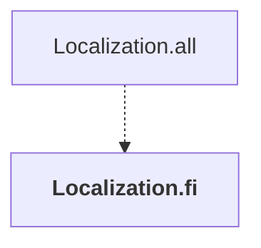

# Localization.fi

## Overview

| Property | Value |
|----------|-------|
| Category | Localization |
| Repository | StockSharp |
| Path | `Localization.Langs/fi/Localization.fi.csproj` |
| Project References | 0 |
| NuGet Dependencies | 0 |
| Consumers | 1 |

## Dependency Diagram

## Consumed By
- Localization.all

---

*[Back to Index](../index.md)*
