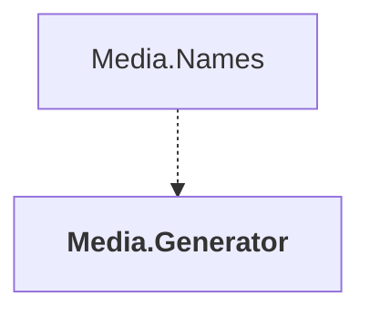

# Media.Generator

## Overview

| Property | Value |
|----------|-------|
| Category | Tool |
| Repository | StockSharp |
| Path | `Media.Generator/Media.Generator.csproj` |
| Project References | 0 |
| NuGet Dependencies | 2 |
| Consumers | 1 |

## Dependency Diagram

## Consumed By
- Media.Names

## External NuGet Packages
| Package | Version |
|---------|---------||
| Microsoft.CodeAnalysis.CSharp | 4.12.0 |
| Microsoft.CodeAnalysis.Analyzers | 3.3.4 |

---

*[Back to Index](../index.md)*
