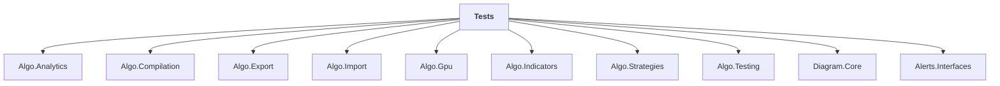

# Tests

## Overview

| Property | Value |
|----------|-------|
| Category | Test |
| Repository | StockSharp |
| Path | `Tests/Tests.csproj` |
| Project References | 10 |
| NuGet Dependencies | 9 |
| Consumers | 0 |

## Dependency Diagram

## Project References
- Algo.Analytics
- Algo.Compilation
- Algo.Export
- Algo.Import
- Algo.Gpu
- Algo.Indicators
- Algo.Strategies
- Algo.Testing
- Diagram.Core
- Alerts.Interfaces

## External NuGet Packages
| Package | Version |
|---------|---------||
| Moq | 4.* |
| Microsoft.NET.Test.Sdk | 17.13.0 |
| MSTest.TestAdapter | 3.11.1 |
| MSTest.TestFramework | 3.11.1 |
| Microsoft.Data.SqlClient | 6.* |

## Internal NuGet Packages
| Package | Version |
|---------|---------|
| Ecng.UnitTesting | 1.0.* |
| StockSharp.Samples.HistoryData | 5.* |
| Ecng.Excel.OpenXml | 1.0.* |
| Ecng.Data.Ado | 1.0.* |

## Data Access Patterns
### IMessageAdapter
| File | Line | Context |
|------|------|---------||
| `Tests/SecurityNativeIdMessageAdapterTests.cs` | 6 | `private sealed class TestPassThroughAdapter : PassThroughMessageAdapte` |
| `Tests/RecordingMessageAdapter.cs` | 3 | `sealed class RecordingMessageAdapter : MessageAdapter` |
| `Tests/BasketMessageAdapterRoutingTests.cs` | 13 | `private sealed class TestRoutingInnerAdapter : MessageAdapter` |
| `Tests/BasketRoutingManagerTests.cs` | 14 | `private sealed class TestRoutingAdapter : MessageAdapter` |
| `Tests/AdapterRouterTests.cs` | 14 | `private sealed class TestRouterAdapter : MessageAdapter` |
| `Tests/StorageMessageAdapterTests.cs` | 10 | `private sealed class TestInnerAdapter : PassThroughMessageAdapter` |
| `Tests/ConnectorBasketTests.cs` | 35 | `private sealed class MockAdapter : MessageAdapter` |
| `Tests/FindAdaptersTests.cs` | 8 | `public class FindAdaptersTestValidAdapter(IdGenerator transactionIdGen` |
| `Tests/FindAdaptersTests.cs` | 17 | `public class FindAdaptersTestNoIdGeneratorConstructorAdapter() : Messa` |
| `Tests/FindAdaptersTests.cs` | 26 | `public class FindAdaptersTestPrivateConstructorAdapter : MessageAdapte` |
| `Tests/FindAdaptersTests.cs` | 51 | `public abstract class FindAdaptersTestAbstractAdapter(IdGenerator tran` |
| `Tests/FindAdaptersTests.cs` | 58 | `public class FindAdaptersTestMultipleConstructorsAdapter : MessageAdap` |
| `Tests/ConnectorRoutingTests.cs` | 18 | `private sealed class LiveFeedCryptoAdapter : MessageAdapter` |
| `Tests/BasketTestBase.cs` | 13 | `protected sealed class TestBasketInnerAdapter : MessageAdapter` |
| `Tests/ExtensionsMethodsTests.cs` | 3528 | `private sealed class TestMessageAdapter : MessageAdapter` |

*... and 18 more*

### FileStorage
| File | Line | Context |
|------|------|---------||
| `Tests/StrategyReportTemplateHelper.cs` | 141 | `using var file = File.Create(filePath);` |

### SqlClient
| File | Line | Context |
|------|------|---------||
| `Tests/AsmInit.cs` | 8 | `using Microsoft.Data.SqlClient;` |

### ConnectionString
| File | Line | Context |
|------|------|---------||
| `Tests/ExportTests.cs` | 51 | `ConnectionString = GetSecret("DB_CONNECTION_STRING"),` |

---

*[Back to Index](../index.md)*
