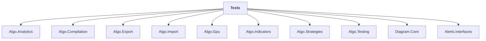

# Tests

## Overview

| Property | Value |
|----------|-------|
| Category | Test |
| Repository | StockSharp |
| Path | `Tests/Tests.csproj` |
| Project References | 10 |
| NuGet Dependencies | 9 |
| Consumers | 0 |

## Dependency Diagram

## Project References
- Algo.Analytics
- Algo.Compilation
- Algo.Export
- Algo.Import
- Algo.Gpu
- Algo.Indicators
- Algo.Strategies
- Algo.Testing
- Diagram.Core
- Alerts.Interfaces

## External NuGet Packages
| Package | Version |
|---------|---------||
| Moq | 4.* |
| Microsoft.NET.Test.Sdk | 17.13.0 |
| MSTest.TestAdapter | 3.11.1 |
| MSTest.TestFramework | 3.11.1 |
| Microsoft.Data.SqlClient | 6.* |

## Internal NuGet Packages
| Package | Version |
|---------|---------|
| Ecng.UnitTesting | 1.0.* |
| StockSharp.Samples.HistoryData | 5.* |
| Ecng.Excel.OpenXml | 1.0.* |
| Ecng.Data.Ado | 1.0.* |

## Data Access Patterns
### Redis.Read
| File | Line | Context |
|------|------|---------||
| `Tests/SnapshotRegistryTests.cs` | 51 | `var snapDay1 = storage.Get(secId);` |
| `Tests/SnapshotRegistryTests.cs` | 68 | `var latest = storage.Get(secId);` |
| `Tests/SnapshotRegistryTests.cs` | 98 | `storage.Get(secId1).AssertNotNull();` |
| `Tests/SnapshotRegistryTests.cs` | 99 | `storage.Get(secId2).AssertNotNull();` |
| `Tests/SnapshotRegistryTests.cs` | 102 | `storage.Get(secId1).AssertNull();` |
| `Tests/SnapshotRegistryTests.cs` | 103 | `storage.Get(secId2).AssertNotNull();` |
| `Tests/SnapshotRegistryTests.cs` | 106 | `storage.Get(secId1).AssertNull();` |
| `Tests/SnapshotRegistryTests.cs` | 107 | `storage.Get(secId2).AssertNull();` |
| `Tests/SnapshotRegistryTests.cs` | 137 | `var snap1 = storage.Get(secId);` |
| `Tests/SnapshotRegistryTests.cs` | 151 | `var snap2 = storage.Get(secId);` |
| `Tests/CsvStorageTests.cs` | 963 | `var item2 = await ((IExtendedInfoStorage)storage2).GetAsync("TestStora` |
| `Tests/CsvStorageTests.cs` | 1063 | `var items = await storage.GetAsync(token);` |
| `Tests/CsvStorageTests.cs` | 1294 | `var itemsB = await storageB.GetAsync(token);` |
| `Tests/CsvStorageTests.cs` | 1299 | `var itemsA = await storageA.GetAsync(token);` |
| `Tests/IndicatorTests.cs` | 744 | `var builder = provider.Get(typeof(TimeFrameCandleMessage));` |

*... and 55 more*

### IMessageAdapter
| File | Line | Context |
|------|------|---------||
| `Tests/SecurityNativeIdMessageAdapterTests.cs` | 6 | `private sealed class TestPassThroughAdapter : PassThroughMessageAdapte` |
| `Tests/RecordingMessageAdapter.cs` | 3 | `sealed class RecordingMessageAdapter : MessageAdapter` |
| `Tests/BasketMessageAdapterRoutingTests.cs` | 13 | `private sealed class TestRoutingInnerAdapter : MessageAdapter` |
| `Tests/BasketRoutingManagerTests.cs` | 14 | `private sealed class TestRoutingAdapter : MessageAdapter` |
| `Tests/AdapterRouterTests.cs` | 14 | `private sealed class TestRouterAdapter : MessageAdapter` |
| `Tests/StorageMessageAdapterTests.cs` | 10 | `private sealed class TestInnerAdapter : PassThroughMessageAdapter` |
| `Tests/ConnectorBasketTests.cs` | 35 | `private sealed class MockAdapter : MessageAdapter` |
| `Tests/FindAdaptersTests.cs` | 8 | `public class FindAdaptersTestValidAdapter(IdGenerator transactionIdGen` |
| `Tests/FindAdaptersTests.cs` | 17 | `public class FindAdaptersTestNoIdGeneratorConstructorAdapter() : Messa` |
| `Tests/FindAdaptersTests.cs` | 26 | `public class FindAdaptersTestPrivateConstructorAdapter : MessageAdapte` |
| `Tests/FindAdaptersTests.cs` | 51 | `public abstract class FindAdaptersTestAbstractAdapter(IdGenerator tran` |
| `Tests/FindAdaptersTests.cs` | 58 | `public class FindAdaptersTestMultipleConstructorsAdapter : MessageAdap` |
| `Tests/ConnectorRoutingTests.cs` | 18 | `private sealed class LiveFeedCryptoAdapter : MessageAdapter` |
| `Tests/BasketTestBase.cs` | 13 | `protected sealed class TestBasketInnerAdapter : MessageAdapter` |
| `Tests/ExtensionsMethodsTests.cs` | 3528 | `private sealed class TestMessageAdapter : MessageAdapter` |

*... and 18 more*

### HttpClient.DeleteAsync
| File | Line | Context |
|------|------|---------||
| `Tests/PermissionsTests.cs` | 538 | `var deleted = await storage.DeleteAsync("delete", CancellationToken);` |
| `Tests/PermissionsTests.cs` | 551 | `var deleted = await storage.DeleteAsync("nonexistent", CancellationTok` |
| `Tests/FileCredentialsStorageTests.cs` | 119 | `var result = await storage.DeleteAsync("test@example.com", Cancellatio` |
| `Tests/FileCredentialsStorageTests.cs` | 132 | `var result = await storage.DeleteAsync("nonexistent", CancellationToke` |
| `Tests/FileCredentialsStorageTests.cs` | 213 | `var result = await storage.DeleteAsync("TEST@EXAMPLE.COM", Cancellatio` |

### HttpClient.GetAsync
| File | Line | Context |
|------|------|---------||
| `Tests/CsvStorageTests.cs` | 963 | `var item2 = await ((IExtendedInfoStorage)storage2).GetAsync("TestStora` |

### File.Write
| File | Line | Context |
|------|------|---------||
| `Tests/StrategyReportTemplateHelper.cs` | 141 | `using var file = File.Create(filePath);` |

### File.Read
| File | Line | Context |
|------|------|---------||
| `Tests/IndicatorTests.cs` | 1367 | `var data = Do.Invariant(() => File.ReadAllLines(Path.Combine(Helper.Re` |
| `Tests/AsmInit.cs` | 25 | `await CompilationExtensions.Init(Paths.FileSystem, Helper.LogManager.A` |
| `Tests/CompilationTests.cs` | 80 | `var sourceCode = await File.ReadAllTextAsync(scriptFile, token);` |
| `Tests/CompilationTests.cs` | 126 | `? await File.ReadAllTextAsync(Path.Combine(folderPath, "Properties", "` |
| `Tests/CompilationTests.cs` | 166 | `var sourceCode = await File.ReadAllTextAsync(scriptFile, token);` |
| `Tests/CompilationTests.cs` | 490 | `var sourceCode = File.ReadAllText(Path.Combine(_designerFolder, fileNa` |
| `Tests/CompilationTests.cs` | 529 | `var sourceCode = File.ReadAllText(Path.Combine(_designerFolder, fileNa` |
| `Tests/CompilationTests.cs` | 572 | `var sourceCode = File.ReadAllText(Path.Combine(_designerFolder, fileNa` |
| `Tests/ReportTests.cs` | 180 | `var expected = File.ReadAllText(expectedPath);` |

### Kafka.Consumer
| File | Line | Context |
|------|------|---------||
| `Tests/ConnectorRoutingTests.cs` | 451 | `connector.Subscribe(btcSubscription);` |
| `Tests/ConnectorRoutingTests.cs` | 452 | `connector.Subscribe(ethSubscription);` |
| `Tests/ConnectorRoutingTests.cs` | 579 | `connector.Subscribe(btcSub);` |
| `Tests/ConnectorRoutingTests.cs` | 580 | `connector.Subscribe(ethSub);` |
| `Tests/ConnectorRoutingTests.cs` | 715 | `connector.Subscribe(sub);` |
| `Tests/ConnectorRoutingTests.cs` | 796 | `connector.Subscribe(sub);` |
| `Tests/ConnectorRoutingTests.cs` | 859 | `connector.Subscribe(sub);` |
| `Tests/ConnectorRoutingTests.cs` | 898 | `connector.Subscribe(btcSub);` |
| `Tests/ConnectorRoutingTests.cs` | 1005 | `connector.Subscribe(sub1);` |
| `Tests/ConnectorRoutingTests.cs` | 1006 | `connector.Subscribe(sub2);` |
| `Tests/ConnectorRoutingTests.cs` | 1083 | `connector.Subscribe(sub);` |
| `Tests/ConnectorRoutingTests.cs` | 1124 | `connector.Subscribe(sub);` |
| `Tests/StrategyDecomposedTests.cs` | 499 | `registry.Subscribe(sub);` |
| `Tests/StrategyDecomposedTests.cs` | 520 | `registry.Subscribe(sub);` |
| `Tests/StrategyDecomposedTests.cs` | 539 | `registry.Subscribe(sub1);` |

*... and 33 more*

### MongoDB.Read
| File | Line | Context |
|------|------|---------||
| `Tests/MarketEmulatorTests.cs` | 130 | `var m = (ExecutionMessage)res.Find(x => x is ExecutionMessage em && em` |
| `Tests/MarketEmulatorTests.cs` | 157 | `var m = (ExecutionMessage)res.Find(x => x is ExecutionMessage em && em` |

### SqlClient
| File | Line | Context |
|------|------|---------||
| `Tests/AsmInit.cs` | 8 | `using Microsoft.Data.SqlClient;` |

### ConnectionString
| File | Line | Context |
|------|------|---------||
| `Tests/ExportTests.cs` | 51 | `ConnectionString = GetSecret("DB_CONNECTION_STRING"),` |

---

*[Back to Index](../index.md)*
