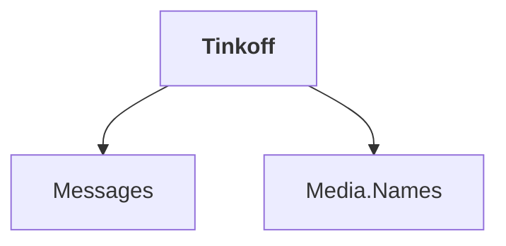

# Tinkoff

## Overview

| Property | Value |
|----------|-------|
| Category | Connector |
| Repository | StockSharp |
| Path | `Connectors/Tinkoff/Tinkoff.csproj` |
| Project References | 2 |
| NuGet Dependencies | 4 |
| Consumers | 0 |

## Dependency Diagram

## Project References
- Messages
- Media.Names

## External NuGet Packages
| Package | Version |
|---------|---------||
| Grpc.Net.Client | 2.71.0 |
| Google.Protobuf | 3.* |

## Internal NuGet Packages
| Package | Version |
|---------|---------|
| Ecng.Net.SocketIO | 1.0.* |
| Ecng.IO.Compression | 1.0.* |

---

*[Back to Index](../index.md)*
