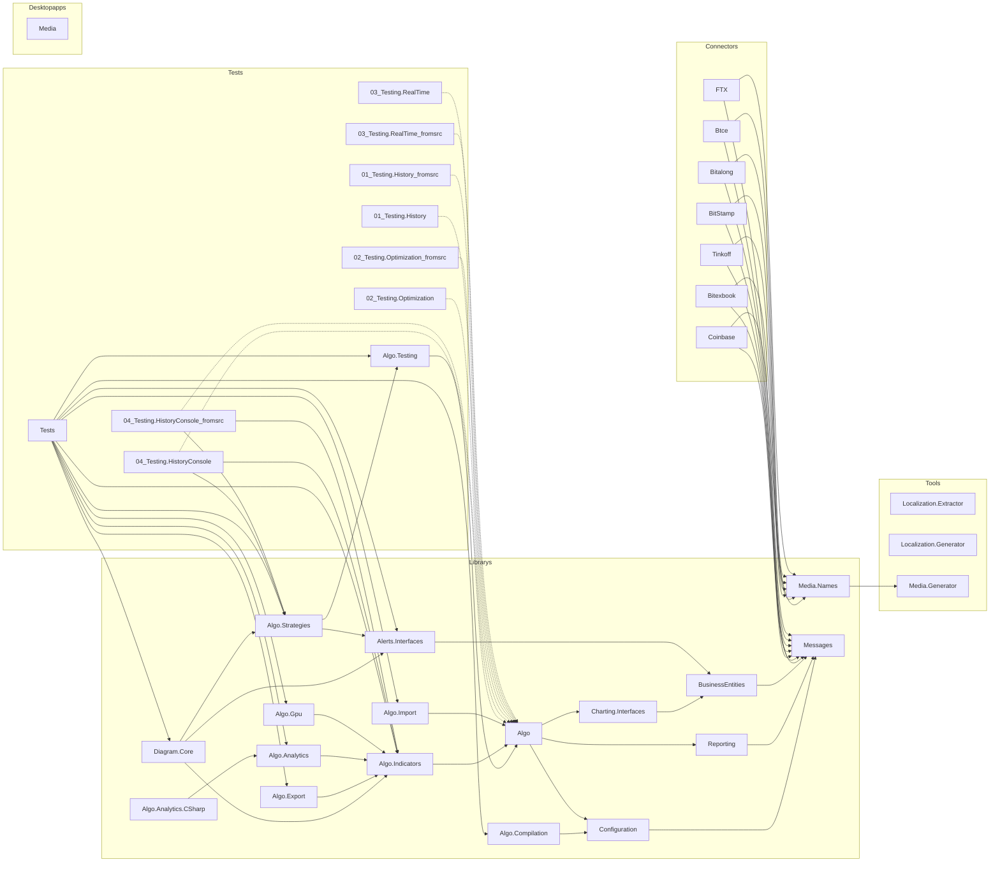
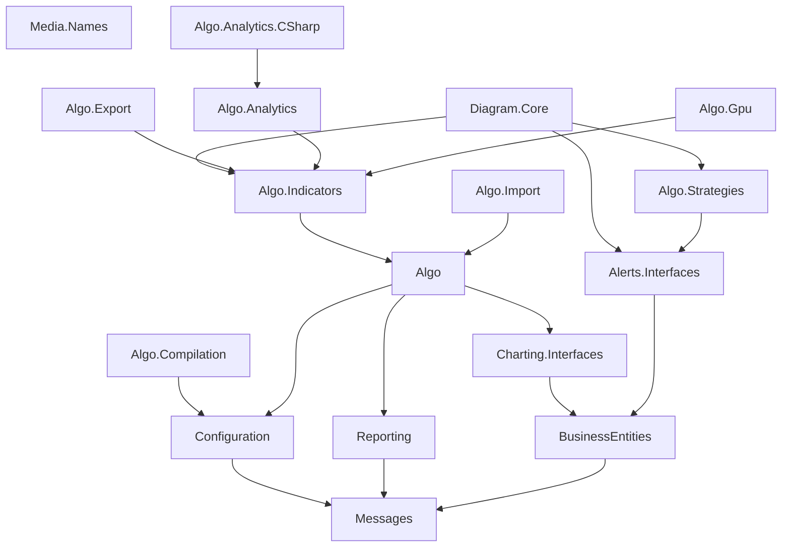
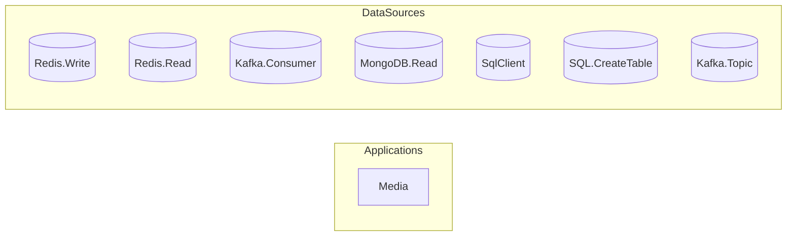
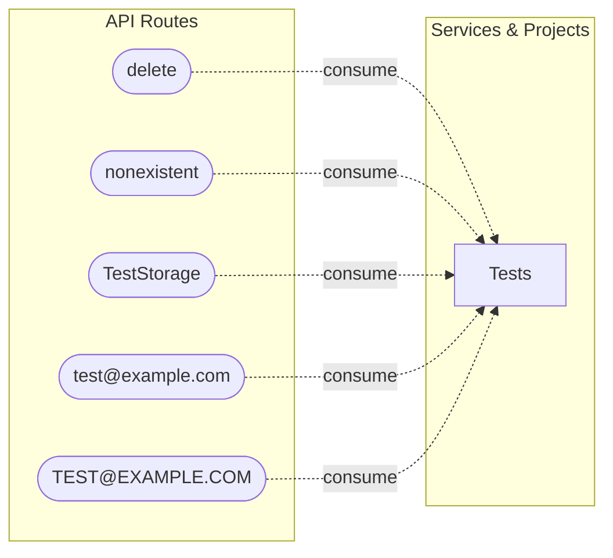
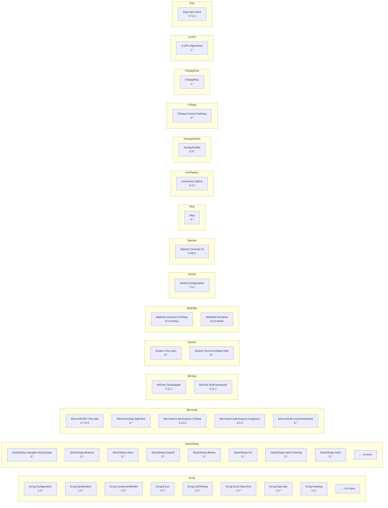
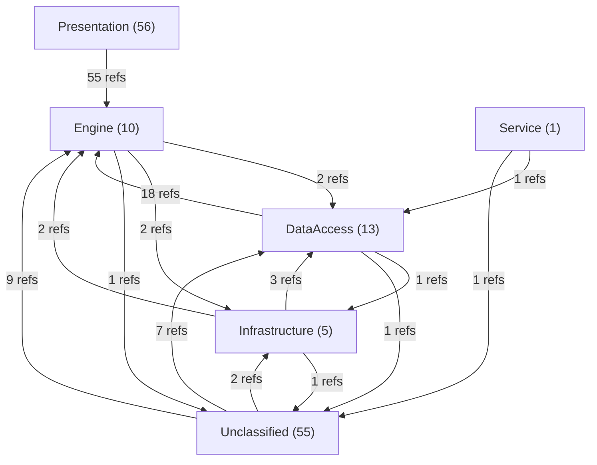

# Dependency Visualizations

## landscape

```mermaid
graph LR
    subgraph Tests
        StockSharp_Algo_Testing["Algo.Testing"]
        StockSharp_Tests["Tests"]
        StockSharp_04_Testing_HistoryConsole["04_Testing.HistoryConsole"]
        StockSharp_04_Testing_HistoryConsole_fromsrc["04_Testing.HistoryConsole_fromsrc"]
        StockSharp_02_Testing_Optimization["02_Testing.Optimization"]
        StockSharp_02_Testing_Optimization_fromsrc["02_Testing.Optimization_fromsrc"]
        StockSharp_01_Testing_History["01_Testing.History"]
        StockSharp_01_Testing_History_fromsrc["01_Testing.History_fromsrc"]
        StockSharp_03_Testing_RealTime_fromsrc["03_Testing.RealTime_fromsrc"]
        StockSharp_03_Testing_RealTime["03_Testing.RealTime"]
    end
    subgraph Librarys
        StockSharp_Media_Names["Media.Names"]
        StockSharp_Configuration["Configuration"]
        StockSharp_Charting_Interfaces["Charting.Interfaces"]
        StockSharp_Algo_Indicators["Algo.Indicators"]
        StockSharp_Diagram_Core["Diagram.Core"]
        StockSharp_Reporting["Reporting"]
        StockSharp_Algo_Import["Algo.Import"]
        StockSharp_Algo_Analytics_CSharp["Algo.Analytics.CSharp"]
        StockSharp_BusinessEntities["BusinessEntities"]
        StockSharp_Messages["Messages"]
        StockSharp_Algo_Strategies["Algo.Strategies"]
        StockSharp_Algo_Export["Algo.Export"]
        StockSharp_Alerts_Interfaces["Alerts.Interfaces"]
        StockSharp_Algo_Analytics["Algo.Analytics"]
        StockSharp_Algo_Compilation["Algo.Compilation"]
        StockSharp_Algo_Gpu["Algo.Gpu"]
        StockSharp_Algo["Algo"]
    end
    subgraph Tools
        StockSharp_Localization_Extractor["Localization.Extractor"]
        StockSharp_Localization_Generator["Localization.Generator"]
        StockSharp_Media_Generator["Media.Generator"]
    end
    subgraph Desktopapps
        StockSharp_Media["Media"]
    end
    subgraph Connectors
        StockSharp_Coinbase["Coinbase"]
        StockSharp_Bitexbook["Bitexbook"]
        StockSharp_Tinkoff["Tinkoff"]
        StockSharp_BitStamp["BitStamp"]
        StockSharp_Bitalong["Bitalong"]
        StockSharp_Btce["Btce"]
        StockSharp_FTX["FTX"]
    end
    StockSharp_Algo_Testing --> StockSharp_Algo
    StockSharp_Media_Names --> StockSharp_Media_Generator
    StockSharp_Configuration --> StockSharp_Messages
    StockSharp_Charting_Interfaces --> StockSharp_BusinessEntities
    StockSharp_Algo_Indicators --> StockSharp_Algo
    StockSharp_Diagram_Core --> StockSharp_Alerts_Interfaces
    StockSharp_Diagram_Core --> StockSharp_Algo_Strategies
    StockSharp_Diagram_Core --> StockSharp_Algo_Indicators
    StockSharp_Reporting --> StockSharp_Messages
    StockSharp_Algo_Import --> StockSharp_Algo
    StockSharp_Algo_Analytics_CSharp --> StockSharp_Algo_Analytics
    StockSharp_Tests --> StockSharp_Algo_Analytics
    StockSharp_Tests --> StockSharp_Algo_Compilation
    StockSharp_Tests --> StockSharp_Algo_Export
    StockSharp_Tests --> StockSharp_Algo_Import
    StockSharp_Tests --> StockSharp_Algo_Gpu
    StockSharp_Tests --> StockSharp_Algo_Indicators
    StockSharp_Tests --> StockSharp_Algo_Strategies
    StockSharp_Tests --> StockSharp_Algo_Testing
    StockSharp_Tests --> StockSharp_Diagram_Core
    StockSharp_Tests --> StockSharp_Alerts_Interfaces
    StockSharp_BusinessEntities --> StockSharp_Messages
    StockSharp_Algo_Strategies --> StockSharp_Alerts_Interfaces
    StockSharp_Algo_Strategies --> StockSharp_Algo_Testing
    StockSharp_Algo_Export --> StockSharp_Algo_Indicators
    StockSharp_Alerts_Interfaces --> StockSharp_BusinessEntities
    StockSharp_Algo_Analytics --> StockSharp_Algo_Indicators
    StockSharp_Algo_Compilation --> StockSharp_Configuration
    StockSharp_Algo_Gpu --> StockSharp_Algo_Indicators
    StockSharp_04_Testing_HistoryConsole -.-> StockSharp_Algo
    StockSharp_04_Testing_HistoryConsole --> StockSharp_Algo_Indicators
    StockSharp_04_Testing_HistoryConsole --> StockSharp_Algo_Strategies
    StockSharp_04_Testing_HistoryConsole_fromsrc -.-> StockSharp_Algo
    StockSharp_04_Testing_HistoryConsole_fromsrc --> StockSharp_Algo_Indicators
    StockSharp_04_Testing_HistoryConsole_fromsrc --> StockSharp_Algo_Strategies
    StockSharp_02_Testing_Optimization -.-> StockSharp_Algo
    StockSharp_02_Testing_Optimization_fromsrc -.-> StockSharp_Algo
    StockSharp_01_Testing_History -.-> StockSharp_Algo
    StockSharp_01_Testing_History_fromsrc -.-> StockSharp_Algo
    StockSharp_03_Testing_RealTime_fromsrc -.-> StockSharp_Algo
    StockSharp_03_Testing_RealTime -.-> StockSharp_Algo
    StockSharp_Coinbase --> StockSharp_Messages
    StockSharp_Coinbase --> StockSharp_Media_Names
    StockSharp_Bitexbook --> StockSharp_Messages
    StockSharp_Bitexbook --> StockSharp_Media_Names
    StockSharp_Tinkoff --> StockSharp_Messages
    StockSharp_Tinkoff --> StockSharp_Media_Names
    StockSharp_BitStamp --> StockSharp_Messages
    StockSharp_BitStamp --> StockSharp_Media_Names
    StockSharp_Bitalong --> StockSharp_Messages
    StockSharp_Bitalong --> StockSharp_Media_Names
    StockSharp_Btce --> StockSharp_Messages
    StockSharp_Btce --> StockSharp_Media_Names
    StockSharp_FTX --> StockSharp_Messages
    StockSharp_FTX --> StockSharp_Media_Names
    StockSharp_Algo --> StockSharp_Reporting
    StockSharp_Algo --> StockSharp_Charting_Interfaces
    StockSharp_Algo --> StockSharp_Configuration
```

## core libraries

```mermaid
graph TD
    StockSharp_Media_Names["Media.Names"]
    StockSharp_Configuration["Configuration"]
    StockSharp_Charting_Interfaces["Charting.Interfaces"]
    StockSharp_Algo_Indicators["Algo.Indicators"]
    StockSharp_Diagram_Core["Diagram.Core"]
    StockSharp_Reporting["Reporting"]
    StockSharp_Algo_Import["Algo.Import"]
    StockSharp_Algo_Analytics_CSharp["Algo.Analytics.CSharp"]
    StockSharp_BusinessEntities["BusinessEntities"]
    StockSharp_Messages["Messages"]
    StockSharp_Algo_Strategies["Algo.Strategies"]
    StockSharp_Algo_Export["Algo.Export"]
    StockSharp_Alerts_Interfaces["Alerts.Interfaces"]
    StockSharp_Algo_Analytics["Algo.Analytics"]
    StockSharp_Algo_Compilation["Algo.Compilation"]
    StockSharp_Algo_Gpu["Algo.Gpu"]
    StockSharp_Algo["Algo"]
    StockSharp_Configuration --> StockSharp_Messages
    StockSharp_Charting_Interfaces --> StockSharp_BusinessEntities
    StockSharp_Algo_Indicators --> StockSharp_Algo
    StockSharp_Diagram_Core --> StockSharp_Alerts_Interfaces
    StockSharp_Diagram_Core --> StockSharp_Algo_Strategies
    StockSharp_Diagram_Core --> StockSharp_Algo_Indicators
    StockSharp_Reporting --> StockSharp_Messages
    StockSharp_Algo_Import --> StockSharp_Algo
    StockSharp_Algo_Analytics_CSharp --> StockSharp_Algo_Analytics
    StockSharp_BusinessEntities --> StockSharp_Messages
    StockSharp_Algo_Strategies --> StockSharp_Alerts_Interfaces
    StockSharp_Algo_Export --> StockSharp_Algo_Indicators
    StockSharp_Alerts_Interfaces --> StockSharp_BusinessEntities
    StockSharp_Algo_Analytics --> StockSharp_Algo_Indicators
    StockSharp_Algo_Compilation --> StockSharp_Configuration
    StockSharp_Algo_Gpu --> StockSharp_Algo_Indicators
    StockSharp_Algo --> StockSharp_Reporting
    StockSharp_Algo --> StockSharp_Charting_Interfaces
    StockSharp_Algo --> StockSharp_Configuration
```

## data infrastructure

```mermaid
graph LR
    subgraph Applications
        StockSharp_Media["Media"]
    end
    subgraph DataSources
        datasource_StockSharp_Redis_Write[("Redis.Write")]
        datasource_StockSharp_Redis_Read[("Redis.Read")]
        datasource_StockSharp_Kafka_Consumer[("Kafka.Consumer")]
        datasource_StockSharp_MongoDB_Read[("MongoDB.Read")]
        datasource_StockSharp_SqlClient[("SqlClient")]
        datasource_StockSharp_SQL_CreateTable[("SQL.CreateTable")]
        datasource_StockSharp_Kafka_Topic[("Kafka.Topic")]
    end
```

## data flow

```mermaid
graph LR
    subgraph Projects["Services & Projects"]
        Tests["Tests"]
    end
    subgraph APIs["API Routes"]
        url_delete(["delete"])
        url_nonexistent(["nonexistent"])
        url_TestStorage(["TestStorage"])
        url_test_example_com(["test@example.com"])
        url_TEST_EXAMPLE_COM(["TEST@EXAMPLE.COM"])
    end
    url_delete -.->|consume| Tests
    url_nonexistent -.->|consume| Tests
    url_TestStorage -.->|consume| Tests
    url_test_example_com -.->|consume| Tests
    url_TEST_EXAMPLE_COM -.->|consume| Tests
```

## nuget groups

```mermaid
graph LR
    subgraph Ecng["Ecng"]
        nuget_Ecng_Configuration["Ecng.Configuration<br/>1.0.*"]
        nuget_Ecng_Serialization["Ecng.Serialization<br/>1.0.*"]
        nuget_Ecng_ComponentModel["Ecng.ComponentModel<br/>1.0.*"]
        nuget_Ecng_Excel["Ecng.Excel<br/>1.0.*"]
        nuget_Ecng_UnitTesting["Ecng.UnitTesting<br/>1.0.*"]
        nuget_Ecng_Excel_OpenXml["Ecng.Excel.OpenXml<br/>1.0.*"]
        nuget_Ecng_Data_Ado["Ecng.Data.Ado<br/>1.0.*"]
        nuget_Ecng_Drawing["Ecng.Drawing<br/>1.0.*"]
        Ecng_more["... +10 more"]
    end
    subgraph StockSharp["StockSharp"]
        nuget_StockSharp_Samples_HistoryData["StockSharp.Samples.HistoryData<br/>5.*"]
        nuget_StockSharp_Binance["StockSharp.Binance<br/>5.*"]
        nuget_StockSharp_Okex["StockSharp.Okex<br/>5.*"]
        nuget_StockSharp_GateIO["StockSharp.GateIO<br/>5.*"]
        nuget_StockSharp_Bitmex["StockSharp.Bitmex<br/>5.*"]
        nuget_StockSharp_Fix["StockSharp.Fix<br/>5.*"]
        nuget_StockSharp_Xaml_Charting["StockSharp.Xaml.Charting<br/>5.*"]
        nuget_StockSharp_Xaml["StockSharp.Xaml<br/>5.*"]
        StockSharp_more["... +3 more"]
    end
    subgraph Microsoft["Microsoft"]
        nuget_Microsoft_NET_Test_Sdk["Microsoft.NET.Test.Sdk<br/>17.13.0"]
        nuget_Microsoft_Data_SqlClient["Microsoft.Data.SqlClient<br/>6.*"]
        nuget_Microsoft_CodeAnalysis_CSharp["Microsoft.CodeAnalysis.CSharp<br/>4.12.0"]
        nuget_Microsoft_CodeAnalysis_Analyzers["Microsoft.CodeAnalysis.Analyzers<br/>3.3.4"]
        nuget_Microsoft_Bcl_AsyncInterfaces["Microsoft.Bcl.AsyncInterfaces<br/>8.*"]
    end
    subgraph MSTest["MSTest"]
        nuget_MSTest_TestAdapter["MSTest.TestAdapter<br/>3.11.1"]
        nuget_MSTest_TestFramework["MSTest.TestFramework<br/>3.11.1"]
    end
    subgraph System["System"]
        nuget_System_Text_Json["System.Text.Json<br/>8.*"]
        nuget_System_Text_Encodings_Web["System.Text.Encodings.Web<br/>8.*"]
    end
    subgraph MathNet["MathNet"]
        nuget_MathNet_Numerics_FSharp["MathNet.Numerics.FSharp<br/>6.0.0-beta2"]
        nuget_MathNet_Numerics["MathNet.Numerics<br/>6.0.0-beta2"]
    end
    subgraph NuGet["NuGet"]
        nuget_NuGet_Configuration["NuGet.Configuration<br/>7.0.1"]
    end
    subgraph Spectre["Spectre"]
        nuget_Spectre_Console_Cli["Spectre.Console.Cli<br/>0.48.0"]
    end
    subgraph Moq["Moq"]
        nuget_Moq["Moq<br/>4.*"]
    end
    subgraph IronPython["IronPython"]
        nuget_IronPython_StdLib["IronPython.StdLib<br/>3.4.2"]
    end
    subgraph NumpyDotNet["NumpyDotNet"]
        nuget_NumpyDotNet["NumpyDotNet<br/>0.9.*"]
    end
    subgraph FSharp["FSharp"]
        nuget_FSharp_Control_TaskSeq["FSharp.Control.TaskSeq<br/>0.*"]
    end
    subgraph FSharpPlus["FSharpPlus"]
        nuget_FSharpPlus["FSharpPlus<br/>1.*"]
    end
    subgraph ILGPU["ILGPU"]
        nuget_ILGPU_Algorithms["ILGPU.Algorithms<br/>1.*"]
    end
    subgraph Grpc["Grpc"]
        nuget_Grpc_Net_Client["Grpc.Net.Client<br/>2.71.0"]
    end
```

## business layers

```mermaid
graph TD
    layer_Presentation["Presentation (56)"]
    layer_Engine["Engine (10)"]
    layer_Service["Service (1)"]
    layer_DataAccess["DataAccess (13)"]
    layer_Infrastructure["Infrastructure (5)"]
    layer_Unclassified["Unclassified (55)"]
    layer_Presentation -->|55 refs| layer_Engine
    layer_DataAccess -->|18 refs| layer_Engine
    layer_Unclassified -->|9 refs| layer_Engine
    layer_Unclassified -->|7 refs| layer_DataAccess
    layer_Infrastructure -->|3 refs| layer_DataAccess
    layer_Unclassified -->|2 refs| layer_Infrastructure
    layer_Infrastructure -->|2 refs| layer_Engine
    layer_Engine -->|2 refs| layer_DataAccess
    layer_Engine -->|2 refs| layer_Infrastructure
    layer_DataAccess -->|1 refs| layer_Infrastructure
    layer_DataAccess -->|1 refs| layer_Unclassified
    layer_Infrastructure -->|1 refs| layer_Unclassified
    layer_Service -->|1 refs| layer_DataAccess
    layer_Service -->|1 refs| layer_Unclassified
    layer_Engine -->|1 refs| layer_Unclassified
```

## e2e flows

```mermaid
graph TD
    subgraph sg_Presentation["Presentation"]
        01_Advanced_MultiConnect["01_Advanced.MultiConnect"]
        01_Advanced_MultiConnect_fromsrc["01_Advanced.MultiConnect_fromsrc"]
        01_Candles_Realtime["01_Candles.Realtime"]
        01_Candles_Realtime_fromsrc["01_Candles.Realtime_fromsrc"]
        01_Misc_Logging["01_Misc.Logging"]
        01_Misc_Logging_fromsrc["01_Misc.Logging_fromsrc"]
        01_Strategies_HistorySMA["01_Strategies.HistorySMA"]
        01_Strategies_HistorySMA_fromsrc["01_Strategies.HistorySMA_fromsrc"]
        01_Testing_History["01_Testing.History"]
        01_Testing_History_fromsrc["01_Testing.History_fromsrc"]
        02_Candles_CombineHistoryRealtime["02_Candles.CombineHistoryRealtime"]
        02_Candles_CombineHistoryRealtime_fromsrc["02_Candles.CombineHistoryRealtime_fromsrc"]
        02_Strategies_HistoryBollingerBands["02_Strategies.HistoryBollingerBands"]
        02_Strategies_HistoryBollingerBands_fromsrc["02_Strategies.HistoryBollingerBands_fromsrc"]
        02_Testing_Optimization["02_Testing.Optimization"]
        02_Testing_Optimization_fromsrc["02_Testing.Optimization_fromsrc"]
        03_Strategies_HistoryTrend["03_Strategies.HistoryTrend"]
        03_Strategies_HistoryTrend_fromsrc["03_Strategies.HistoryTrend_fromsrc"]
        03_Testing_RealTime["03_Testing.RealTime"]
        03_Testing_RealTime_fromsrc["03_Testing.RealTime_fromsrc"]
        04_Storage_HydraServerConnect_fromsrc["04_Storage.HydraServerConnect_fromsrc"]
        04_Strategies_HistoryMarketRule["04_Strategies.HistoryMarketRule"]
        04_Strategies_HistoryMarketRule_fromsrc["04_Strategies.HistoryMarketRule_fromsrc"]
        05_Strategies_HistoryIndex["05_Strategies.HistoryIndex"]
        05_Strategies_HistoryIndex_fromsrc["05_Strategies.HistoryIndex_fromsrc"]
        06_Strategies_HistoryQuoting["06_Strategies.HistoryQuoting"]
        06_Strategies_HistoryQuoting_fromsrc["06_Strategies.HistoryQuoting_fromsrc"]
        07_Strategies_LiveSpread["07_Strategies.LiveSpread"]
        07_Strategies_LiveSpread_fromsrc["07_Strategies.LiveSpread_fromsrc"]
        08_Strategies_LiveArbitrage["08_Strategies.LiveArbitrage"]
        08_Strategies_LiveArbitrage_fromsrc["08_Strategies.LiveArbitrage_fromsrc"]
        09_Strategies_LiveOptionsQuoting["09_Strategies.LiveOptionsQuoting"]
        09_Strategies_LiveOptionsQuoting_fromsrc["09_Strategies.LiveOptionsQuoting_fromsrc"]
        10_Strategies_LiveTerminal["10_Strategies.LiveTerminal"]
        10_Strategies_LiveTerminal_fromsrc["10_Strategies.LiveTerminal_fromsrc"]
    end
    subgraph sg_Engine["Engine"]
        Algo["Algo"]
    end
    subgraph sg_DataAccess["DataAccess"]
        BusinessEntities["BusinessEntities"]
        Messages["Messages"]
        Reporting["Reporting"]
    end
    subgraph sg_Unclassified["Unclassified"]
        Charting_Interfaces["Charting.Interfaces"]
    end
    01_Candles_Realtime_fromsrc --> Algo
    Algo --> Charting_Interfaces
    Charting_Interfaces --> BusinessEntities
    01_Candles_Realtime --> Algo
    02_Candles_CombineHistoryRealtime --> Algo
    02_Candles_CombineHistoryRealtime_fromsrc --> Algo
    02_Testing_Optimization --> Algo
    02_Testing_Optimization_fromsrc --> Algo
    01_Testing_History --> Algo
    01_Testing_History_fromsrc --> Algo
    03_Testing_RealTime_fromsrc --> Algo
    03_Testing_RealTime --> Algo
    06_Strategies_HistoryQuoting_fromsrc --> Algo
    06_Strategies_HistoryQuoting --> Algo
    04_Strategies_HistoryMarketRule --> Algo
    04_Strategies_HistoryMarketRule_fromsrc --> Algo
    08_Strategies_LiveArbitrage_fromsrc --> Algo
    08_Strategies_LiveArbitrage --> Algo
    03_Strategies_HistoryTrend_fromsrc --> Algo
    03_Strategies_HistoryTrend --> Algo
    05_Strategies_HistoryIndex_fromsrc --> Algo
    05_Strategies_HistoryIndex --> Algo
    10_Strategies_LiveTerminal --> Algo
    10_Strategies_LiveTerminal_fromsrc --> Algo
    07_Strategies_LiveSpread --> Algo
    07_Strategies_LiveSpread_fromsrc --> Algo
    02_Strategies_HistoryBollingerBands --> Algo
    02_Strategies_HistoryBollingerBands_fromsrc --> Algo
    01_Strategies_HistorySMA_fromsrc --> Algo
    01_Strategies_HistorySMA --> Algo
    09_Strategies_LiveOptionsQuoting_fromsrc --> Algo
    09_Strategies_LiveOptionsQuoting --> Algo
    04_Storage_HydraServerConnect_fromsrc --> Algo
    01_Misc_Logging_fromsrc --> Algo
    01_Misc_Logging --> Algo
    01_Advanced_MultiConnect_fromsrc --> Algo
    01_Advanced_MultiConnect --> Algo
    02_Advanced_SaveDataLocal_fromsrc --> Algo
    02_Advanced_SaveDataLocal --> Algo
    03_Indicators_CreateOwn --> Algo
    03_Indicators_CreateOwn_fromsrc --> Algo
    01_Indicators_SimpleSMA --> Algo
    01_Indicators_SimpleSMA_fromsrc --> Algo
    02_Indicators_ComplexBollinger --> Algo
    02_Indicators_ComplexBollinger_fromsrc --> Algo
    02_Basic_MarketDepths_fromsrc --> Algo
    02_Basic_MarketDepths --> Algo
    03_Basic_Orders_fromsrc --> Algo
    03_Basic_Orders --> Algo
    01_Basic_ConnectAndDownloadInstruments --> Algo
    01_Basic_ConnectAndDownloadInstruments_fromsrc --> Algo
    02_Chart_ActiveOrders --> Algo
    02_Chart_ActiveOrders_fromsrc --> Algo
    01_Chart_fromsrc --> Algo
    01_Chart --> Algo
    03_Chart_Performance_fromsrc --> Algo
    03_Chart_Performance --> Algo
    Algo --> Reporting
    Reporting --> Messages
```
