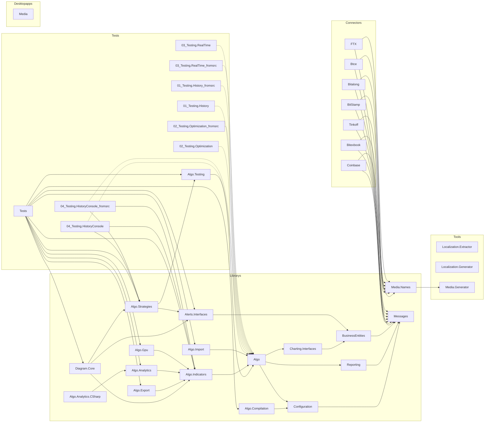
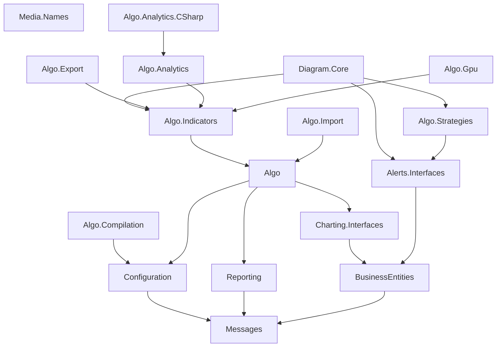
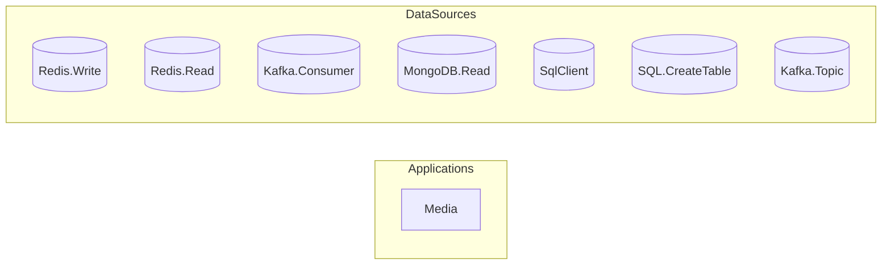
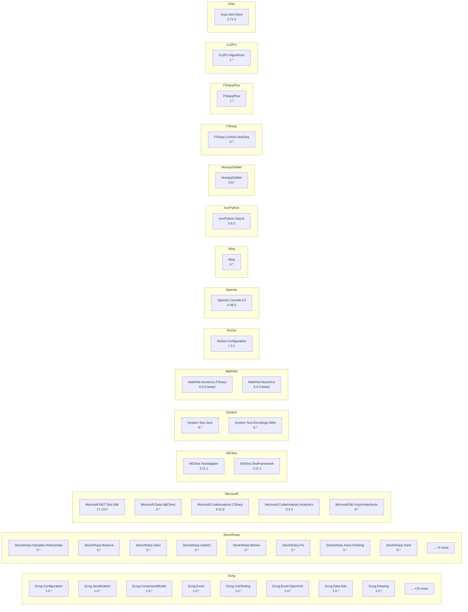

# Dependency Map

## Overview

| Metric | Count |
|--------|-------|
| Repositories | 1 |
| Total Projects | 140 |
| NuGet Packages | 50 |
| Project References | 200 |
| Cross-Repo References | 70 |
| Data Access Findings | 1699 |
| Config Files | 1 |

## Project Categories

| Category | Count |
|----------|-------|
| Sample | 62 |
| Localization | 40 |
| Library | 17 |
| Test | 10 |
| Connector | 7 |
| Tool | 3 |
| DesktopApp | 1 |

## Full Landscape

## Core Library Hierarchy

## Data Infrastructure

## NuGet Package Groups

## Navigation

### Connector (7)
- [Coinbase](connectors/Coinbase.md)
- [Bitexbook](connectors/Bitexbook.md)
- [Tinkoff](connectors/Tinkoff.md)
- [BitStamp](connectors/BitStamp.md)
- [Bitalong](connectors/Bitalong.md)
- [Btce](connectors/Btce.md)
- [FTX](connectors/FTX.md)

### DesktopApp (1)
- [Media](applications/Media.md)

### Library (17)
- [Media.Names](libraries/Media.Names.md)
- [Configuration](libraries/Configuration.md)
- [Charting.Interfaces](libraries/Charting.Interfaces.md)
- [Algo.Indicators](libraries/Algo.Indicators.md)
- [Diagram.Core](libraries/Diagram.Core.md)
- [Reporting](libraries/Reporting.md)
- [Algo.Import](libraries/Algo.Import.md)
- [Algo.Analytics.CSharp](libraries/Algo.Analytics.CSharp.md)
- [BusinessEntities](libraries/BusinessEntities.md)
- [Messages](libraries/Messages.md)
- [Algo.Strategies](libraries/Algo.Strategies.md)
- [Algo.Export](libraries/Algo.Export.md)
- [Alerts.Interfaces](libraries/Alerts.Interfaces.md)
- [Algo.Analytics](libraries/Algo.Analytics.md)
- [Algo.Compilation](libraries/Algo.Compilation.md)
- [Algo.Gpu](libraries/Algo.Gpu.md)
- [Algo](libraries/Algo.md)

### Localization (40)
- [Localization](applications/Localization.md)
- [Localization.all](applications/Localization.all.md)
- [Localization.my](applications/Localization.my.md)
- [Localization.nl](applications/Localization.nl.md)
- [Localization.he](applications/Localization.he.md)
- [Localization.fi](applications/Localization.fi.md)
- [Localization.el](applications/Localization.el.md)
- [Localization.da](applications/Localization.da.md)
- [Localization.sv](applications/Localization.sv.md)
- [Localization.hi](applications/Localization.hi.md)
- [Localization.no](applications/Localization.no.md)
- [Localization.ko](applications/Localization.ko.md)
- [Localization.ar](applications/Localization.ar.md)
- [Localization.ta](applications/Localization.ta.md)
- [Localization.zh](applications/Localization.zh.md)
- [Localization.pt](applications/Localization.pt.md)
- [Localization.es](applications/Localization.es.md)
- [Localization.jv](applications/Localization.jv.md)
- [Localization.fa](applications/Localization.fa.md)
- [Localization.bn](applications/Localization.bn.md)
- ... +20 more

### Sample (62)
- [01_Candles.Realtime_fromsrc](applications/01_Candles.Realtime_fromsrc.md)
- [01_Candles.Realtime](applications/01_Candles.Realtime.md)
- [02_Candles.CombineHistoryRealtime](applications/02_Candles.CombineHistoryRealtime.md)
- [02_Candles.CombineHistoryRealtime_fromsrc](applications/02_Candles.CombineHistoryRealtime_fromsrc.md)
- [06_Strategies.HistoryQuoting_fromsrc](applications/06_Strategies.HistoryQuoting_fromsrc.md)
- [06_Strategies.HistoryQuoting](applications/06_Strategies.HistoryQuoting.md)
- [04_Strategies.HistoryMarketRule](applications/04_Strategies.HistoryMarketRule.md)
- [04_Strategies.HistoryMarketRule_fromsrc](applications/04_Strategies.HistoryMarketRule_fromsrc.md)
- [08_Strategies.LiveArbitrage_fromsrc](applications/08_Strategies.LiveArbitrage_fromsrc.md)
- [08_Strategies.LiveArbitrage](applications/08_Strategies.LiveArbitrage.md)
- [03_Strategies.HistoryTrend_fromsrc](applications/03_Strategies.HistoryTrend_fromsrc.md)
- [03_Strategies.HistoryTrend](applications/03_Strategies.HistoryTrend.md)
- [05_Strategies.HistoryIndex_fromsrc](applications/05_Strategies.HistoryIndex_fromsrc.md)
- [05_Strategies.HistoryIndex](applications/05_Strategies.HistoryIndex.md)
- [10_Strategies.LiveTerminal](applications/10_Strategies.LiveTerminal.md)
- [10_Strategies.LiveTerminal_fromsrc](applications/10_Strategies.LiveTerminal_fromsrc.md)
- [07_Strategies.LiveSpread](applications/07_Strategies.LiveSpread.md)
- [07_Strategies.LiveSpread_fromsrc](applications/07_Strategies.LiveSpread_fromsrc.md)
- [02_Strategies.HistoryBollingerBands](applications/02_Strategies.HistoryBollingerBands.md)
- [02_Strategies.HistoryBollingerBands_fromsrc](applications/02_Strategies.HistoryBollingerBands_fromsrc.md)
- ... +42 more

### Test (10)
- [Algo.Testing](applications/Algo.Testing.md)
- [Tests](applications/Tests.md)
- [04_Testing.HistoryConsole](applications/04_Testing.HistoryConsole.md)
- [04_Testing.HistoryConsole_fromsrc](applications/04_Testing.HistoryConsole_fromsrc.md)
- [02_Testing.Optimization](applications/02_Testing.Optimization.md)
- [02_Testing.Optimization_fromsrc](applications/02_Testing.Optimization_fromsrc.md)
- [01_Testing.History](applications/01_Testing.History.md)
- [01_Testing.History_fromsrc](applications/01_Testing.History_fromsrc.md)
- [03_Testing.RealTime_fromsrc](applications/03_Testing.RealTime_fromsrc.md)
- [03_Testing.RealTime](applications/03_Testing.RealTime.md)

### Tool (3)
- [Localization.Extractor](applications/Localization.Extractor.md)
- [Localization.Generator](applications/Localization.Generator.md)
- [Media.Generator](applications/Media.Generator.md)

- [Data Source Registry](data-sources/registry.md)

---

*Generated: 2026-02-11*
*Tool: Dependency Mapper (Static Analysis)*
