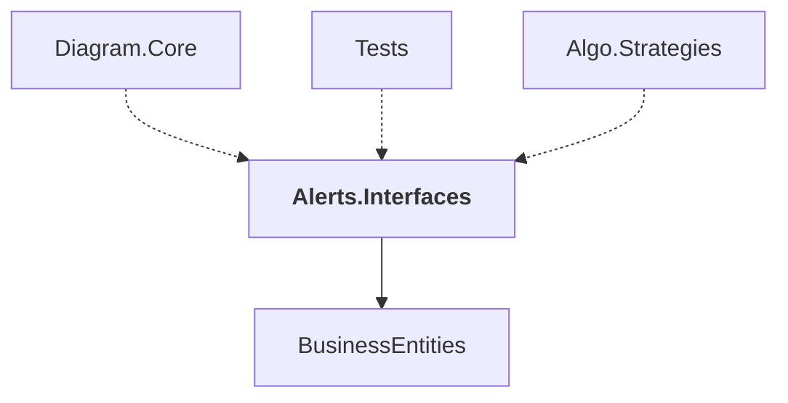

# Alerts.Interfaces

## Overview

| Property | Value |
|----------|-------|
| Category | Library |
| Repository | StockSharp |
| Path | `Alerts.Interfaces/Alerts.Interfaces.csproj` |
| Project References | 1 |
| NuGet Dependencies | 0 |
| Consumers | 3 |

## Dependency Diagram

## Project References
- BusinessEntities

## Consumed By
- Diagram.Core
- Tests
- Algo.Strategies

## Data Access Patterns
### Redis.Write
| File | Line | Context |
|------|------|---------||
| `Alerts.Interfaces/AlertRule.cs` | 61 | `storage.Set(nameof(Field), Field.Save());` |
| `Alerts.Interfaces/AlertRule.cs` | 62 | `storage.Set(nameof(Operator), Operator);` |
| `Alerts.Interfaces/AlertRule.cs` | 65 | `storage.Set(nameof(Value), security.Id);` |
| `Alerts.Interfaces/AlertRule.cs` | 68 | `storage.Set(nameof(Portfolio), true);` |
| `Alerts.Interfaces/AlertRule.cs` | 69 | `storage.Set(nameof(Value), portfolio.Name);` |
| `Alerts.Interfaces/AlertRule.cs` | 72 | `storage.Set(nameof(Value), Value?.ToString());` |
| `Alerts.Interfaces/AlertSchema.cs` | 100 | `.Set(nameof(Rules), Rules.Select(r => r.Save()).ToArray())` |
| `Alerts.Interfaces/AlertSchema.cs` | 101 | `.Set(nameof(AlertType), AlertType.To<string>())` |
| `Alerts.Interfaces/AlertSchema.cs` | 102 | `.Set(nameof(ExternalId), ExternalId)` |
| `Alerts.Interfaces/AlertSchema.cs` | 103 | `.Set(nameof(Caption), Caption)` |
| `Alerts.Interfaces/AlertSchema.cs` | 104 | `.Set(nameof(Message), Message)` |
| `Alerts.Interfaces/AlertSchema.cs` | 105 | `.Set(nameof(IsEnabled), IsEnabled)` |
| `Alerts.Interfaces/AlertSchema.cs` | 106 | `.Set(nameof(Id), Id)` |
| `Alerts.Interfaces/AlertSchema.cs` | 107 | `.Set(nameof(MessageType), MessageType?.GetTypeName(false))` |
| `Alerts.Interfaces/AlertSchema.cs` | 108 | `.Set(nameof(LogLevel), LogLevel)` |

---

*[Back to Index](../index.md)*
