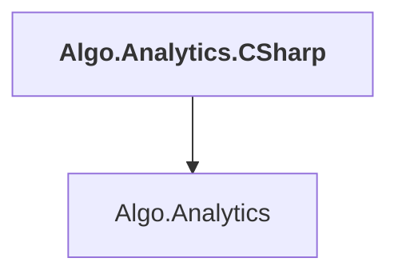

# Algo.Analytics.CSharp

## Overview

| Property | Value |
|----------|-------|
| Category | Library |
| Repository | StockSharp |
| Path | `Algo.Analytics.CSharp/Algo.Analytics.CSharp.csproj` |
| Project References | 1 |
| NuGet Dependencies | 0 |
| Consumers | 0 |

## Dependency Diagram

## Project References
- Algo.Analytics

---

*[Back to Index](../index.md)*
