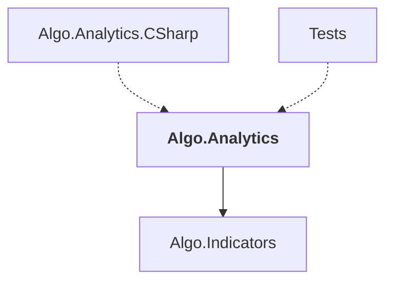

# Algo.Analytics

## Overview

| Property | Value |
|----------|-------|
| Category | Library |
| Repository | StockSharp |
| Path | `Algo.Analytics/Algo.Analytics.csproj` |
| Project References | 1 |
| NuGet Dependencies | 0 |
| Consumers | 2 |

## Dependency Diagram

## Project References
- Algo.Indicators

## Consumed By
- Algo.Analytics.CSharp
- Tests

## Data Access Patterns
### SQL.CreateTable
| File | Line | Context |
|------|------|---------||
| `Algo.Analytics/IAnalyticsPanel.cs` | 11 | `/// Create table to show analytics result.` |

---

*[Back to Index](../index.md)*
