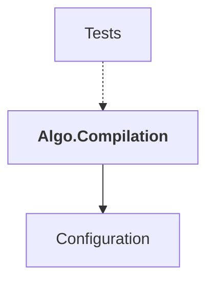

# Algo.Compilation

## Overview

| Property | Value |
|----------|-------|
| Category | Library |
| Repository | StockSharp |
| Path | `Algo.Compilation/Algo.Compilation.csproj` |
| Project References | 1 |
| NuGet Dependencies | 7 |
| Consumers | 1 |

## Dependency Diagram

## Project References
- Configuration

## Consumed By
- Tests

## External NuGet Packages
| Package | Version |
|---------|---------||
| IronPython.StdLib | 3.4.2 |
| NumpyDotNet | 0.9.* |
| MathNet.Numerics.FSharp | 6.0.0-beta2 |
| FSharp.Control.TaskSeq | 0.* |
| FSharpPlus | 1.* |

## Internal NuGet Packages
| Package | Version |
|---------|---------|
| Ecng.Compilation.All | 1.0.* |
| Ecng.Configuration | 1.0.* |

---

*[Back to Index](../index.md)*
