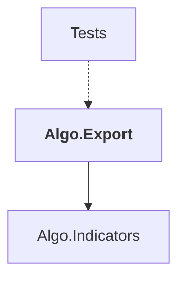

# Algo.Export

## Overview

| Property | Value |
|----------|-------|
| Category | Library |
| Repository | StockSharp |
| Path | `Algo.Export/Algo.Export.csproj` |
| Project References | 1 |
| NuGet Dependencies | 1 |
| Consumers | 1 |

## Dependency Diagram

## Project References
- Algo.Indicators

## Consumed By
- Tests

## Internal NuGet Packages
| Package | Version |
|---------|---------|
| Ecng.Data | 1.0.* |

---

*[Back to Index](../index.md)*
