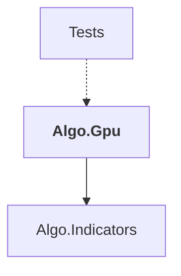

# Algo.Gpu

## Overview

| Property | Value |
|----------|-------|
| Category | Library |
| Repository | StockSharp |
| Path | `Algo.Gpu/Algo.Gpu.csproj` |
| Project References | 1 |
| NuGet Dependencies | 1 |
| Consumers | 1 |

## Dependency Diagram

## Project References
- Algo.Indicators

## Consumed By
- Tests

## External NuGet Packages
| Package | Version |
|---------|---------||
| ILGPU.Algorithms | 1.* |

## Data Access Patterns
### Redis.Read
| File | Line | Context |
|------|------|---------||
| `Algo.Gpu/Indicators/GpuUltimateOscillatorCalculator.cs` | 334 | `var oldBp7 = i >= Period7 ? bpBuffer.Get(oldIndex7) : 0f;` |
| `Algo.Gpu/Indicators/GpuUltimateOscillatorCalculator.cs` | 335 | `var oldBp14 = i >= Period14 ? bpBuffer.Get(oldIndex14) : 0f;` |
| `Algo.Gpu/Indicators/GpuUltimateOscillatorCalculator.cs` | 336 | `var oldBp28 = i >= Period28 ? bpBuffer.Get(oldIndex28) : 0f;` |
| `Algo.Gpu/Indicators/GpuUltimateOscillatorCalculator.cs` | 338 | `var oldTr7 = i >= Period7 ? trBuffer.Get(oldIndex7) : 0f;` |
| `Algo.Gpu/Indicators/GpuUltimateOscillatorCalculator.cs` | 339 | `var oldTr14 = i >= Period14 ? trBuffer.Get(oldIndex14) : 0f;` |
| `Algo.Gpu/Indicators/GpuUltimateOscillatorCalculator.cs` | 340 | `var oldTr28 = i >= Period28 ? trBuffer.Get(oldIndex28) : 0f;` |

### Redis.Write
| File | Line | Context |
|------|------|---------||
| `Algo.Gpu/Indicators/GpuUltimateOscillatorCalculator.cs` | 343 | `bpBuffer.Set(bufferIndex, bp);` |
| `Algo.Gpu/Indicators/GpuUltimateOscillatorCalculator.cs` | 344 | `trBuffer.Set(bufferIndex, tr);` |

---

*[Back to Index](../index.md)*
