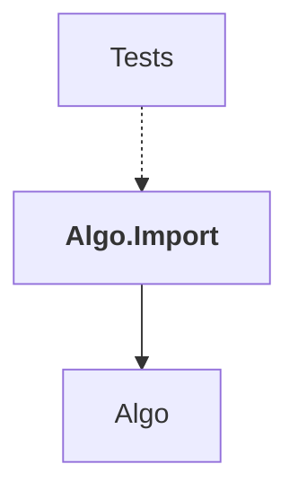

# Algo.Import

## Overview

| Property | Value |
|----------|-------|
| Category | Library |
| Repository | StockSharp |
| Path | `Algo.Import/Algo.Import.csproj` |
| Project References | 1 |
| NuGet Dependencies | 0 |
| Consumers | 1 |

## Dependency Diagram

## Project References
- Algo

## Consumed By
- Tests

## Data Access Patterns
### Redis.Read
| File | Line | Context |
|------|------|---------||
| `Algo.Import/ImportSettings.cs` | 392 | `ExtendedStorage = AsyncHelper.Run(() => eis.GetAsync(extendedStorage, ` |

---

*[Back to Index](../index.md)*
