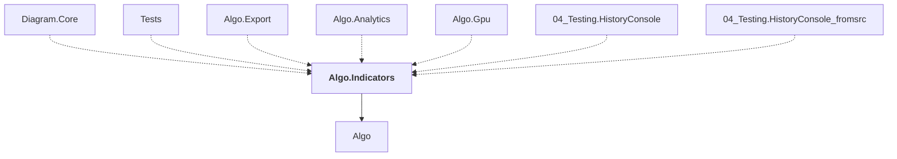

# Algo.Indicators

## Overview

| Property | Value |
|----------|-------|
| Category | Library |
| Repository | StockSharp |
| Path | `Algo.Indicators/Algo.Indicators.csproj` |
| Project References | 1 |
| NuGet Dependencies | 0 |
| Consumers | 7 |

## Dependency Diagram

## Project References
- Algo

## Consumed By
- Diagram.Core
- Tests
- Algo.Export
- Algo.Analytics
- Algo.Gpu
- 04_Testing.HistoryConsole
- 04_Testing.HistoryConsole_fromsrc

## Data Access Patterns
### Redis.Write
| File | Line | Context |
|------|------|---------||
| `Algo.Indicators/ElderImpulseSystem.cs` | 106 | `.Set(nameof(Ema), Ema.Save())` |
| `Algo.Indicators/ElderImpulseSystem.cs` | 107 | `.Set(nameof(Macd), Macd.Save())` |
| `Algo.Indicators/BaseIndicator.cs` | 146 | `.Set(nameof(Id), Id)` |
| `Algo.Indicators/BaseIndicator.cs` | 147 | `.Set(nameof(Name), Name)` |
| `Algo.Indicators/BaseIndicator.cs` | 148 | `.Set(nameof(Source), Source)` |
| `Algo.Indicators/LengthIndicator.cs` | 78 | `.Set(nameof(Length), Length)` |
| `Algo.Indicators/ElderRay.cs` | 77 | `storage.Set(nameof(Length), Length);` |
| `Algo.Indicators/TrueStrengthIndex.cs` | 250 | `.Set(nameof(FirstLength), FirstLength)` |
| `Algo.Indicators/TrueStrengthIndex.cs` | 251 | `.Set(nameof(SecondLength), SecondLength)` |
| `Algo.Indicators/TrueStrengthIndex.cs` | 252 | `.Set(nameof(SignalLength), SignalLength)` |
| `Algo.Indicators/ConstanceBrownCompositeIndex.cs` | 258 | `.Set(nameof(RsiLength), RsiLength)` |
| `Algo.Indicators/ConstanceBrownCompositeIndex.cs` | 259 | `.Set(nameof(RocLength), RocLength)` |
| `Algo.Indicators/ConstanceBrownCompositeIndex.cs` | 260 | `.Set(nameof(ShortRsiLength), ShortRsiLength)` |
| `Algo.Indicators/ConstanceBrownCompositeIndex.cs` | 261 | `.Set(nameof(MomentumLength), MomentumLength)` |
| `Algo.Indicators/ConstanceBrownCompositeIndex.cs` | 262 | `.Set(nameof(FastSmaLength), FastSmaLength)` |

*... and 5 more*

---

*[Back to Index](../index.md)*
