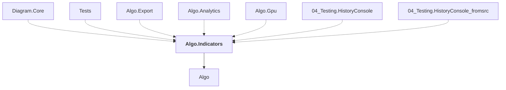

# Algo.Indicators

## Overview

| Property | Value |
|----------|-------|
| Category | Library |
| Repository | StockSharp |
| Path | `Algo.Indicators/Algo.Indicators.csproj` |
| Project References | 1 |
| NuGet Dependencies | 0 |
| Consumers | 7 |

## Dependency Diagram

## Project References
- Algo

## Consumed By
- Diagram.Core
- Tests
- Algo.Export
- Algo.Analytics
- Algo.Gpu
- 04_Testing.HistoryConsole
- 04_Testing.HistoryConsole_fromsrc

---

*[Back to Index](../index.md)*
