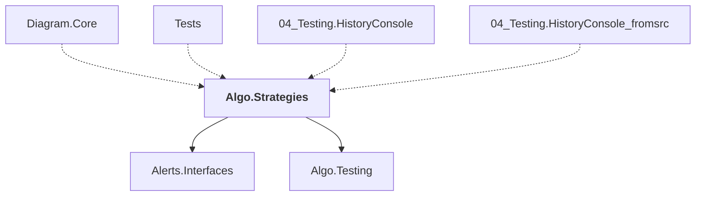

# Algo.Strategies

## Overview

| Property | Value |
|----------|-------|
| Category | Library |
| Repository | StockSharp |
| Path | `Algo.Strategies/Algo.Strategies.csproj` |
| Project References | 2 |
| NuGet Dependencies | 0 |
| Consumers | 4 |

## Dependency Diagram

## Project References
- Alerts.Interfaces
- Algo.Testing

## Consumed By
- Diagram.Core
- Tests
- 04_Testing.HistoryConsole
- 04_Testing.HistoryConsole_fromsrc

---

*[Back to Index](../index.md)*
