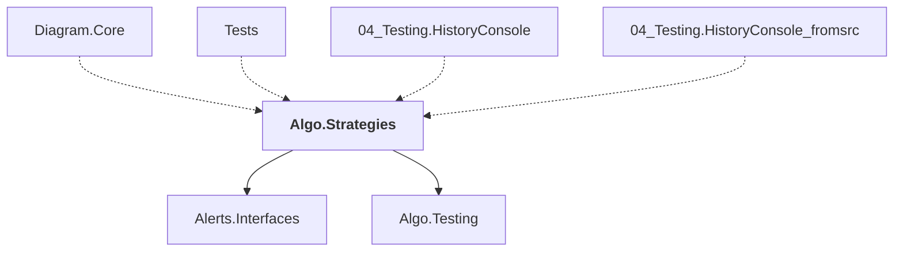

# Algo.Strategies

## Overview

| Property | Value |
|----------|-------|
| Category | Library |
| Repository | StockSharp |
| Path | `Algo.Strategies/Algo.Strategies.csproj` |
| Project References | 2 |
| NuGet Dependencies | 0 |
| Consumers | 4 |

## Dependency Diagram

## Project References
- Alerts.Interfaces
- Algo.Testing

## Consumed By
- Diagram.Core
- Tests
- 04_Testing.HistoryConsole
- 04_Testing.HistoryConsole_fromsrc

## Data Access Patterns
### Redis.Write
| File | Line | Context |
|------|------|---------||
| `Algo.Strategies/StrategyParam.cs` | 456 | `.Set(nameof(Id), Id)` |
| `Algo.Strategies/StrategyParam.cs` | 457 | `.Set(nameof(Value), saveValue())` |
| `Algo.Strategies/StrategyParam.cs` | 458 | `.Set(nameof(CanOptimize), CanOptimize)` |
| `Algo.Strategies/StrategyParam.cs` | 459 | `.Set(nameof(OptimizeFrom), OptimizeFrom?.ToStorage())` |
| `Algo.Strategies/StrategyParam.cs` | 460 | `.Set(nameof(OptimizeTo), OptimizeTo?.ToStorage())` |
| `Algo.Strategies/StrategyParam.cs` | 461 | `.Set(nameof(OptimizeStep), OptimizeStep?.ToStorage());` |
| `Algo.Strategies/Optimization/GeneticSettings.cs` | 395 | `.Set(nameof(Fitness), Fitness)` |
| `Algo.Strategies/Optimization/GeneticSettings.cs` | 396 | `.Set(nameof(Population), Population)` |
| `Algo.Strategies/Optimization/GeneticSettings.cs` | 397 | `.Set(nameof(PopulationMax), PopulationMax)` |
| `Algo.Strategies/Optimization/GeneticSettings.cs` | 398 | `.Set(nameof(GenerationsMax), GenerationsMax)` |
| `Algo.Strategies/Optimization/GeneticSettings.cs` | 399 | `.Set(nameof(GenerationsStagnation), GenerationsStagnation)` |
| `Algo.Strategies/Optimization/GeneticSettings.cs` | 400 | `.Set(nameof(MutationProbability), MutationProbability)` |
| `Algo.Strategies/Optimization/GeneticSettings.cs` | 401 | `.Set(nameof(CrossoverProbability), CrossoverProbability)` |
| `Algo.Strategies/Optimization/GeneticSettings.cs` | 402 | `.Set(nameof(Reinsertion), Reinsertion)` |
| `Algo.Strategies/Optimization/GeneticSettings.cs` | 403 | `.Set(nameof(Mutation), Mutation)` |

*... and 11 more*

### Kafka.Consumer
| File | Line | Context |
|------|------|---------||
| `Algo.Strategies/Quoting/QuotingProcessor.cs` | 181 | `_subProvider.Subscribe(sub);` |
| `Algo.Strategies/Quoting/QuotingProcessor.cs` | 198 | `_subProvider.Subscribe(sub);` |
| `Algo.Strategies/Strategy.cs` | 2097 | `SubscriptionProvider.Subscribe(subscription);` |
| `Algo.Strategies/Decomposed/DecomposedStrategy.cs` | 37 | `Subscriptions.SubscriptionRequested += s => _connector?.Subscribe(s);` |
| `Algo.Strategies/Strategy_SubscriptionProvider.cs` | 139 | `connector.Subscribe(subscription);` |
| `Algo.Strategies/Strategy_HighLevel.cs` | 772 | `_strategy.Subscribe(Subscription);` |

### MongoDB.Read
| File | Line | Context |
|------|------|---------||
| `Algo.Strategies/StrategyParamHelper.cs` | 451 | `totalCount = optimizeDict.Aggregate(1, (c, p) => c * p.Value.iterCount` |
| `Algo.Strategies/StrategyParamHelper.cs` | 555 | `totalCount = optimizeDict.Aggregate(1, (c, p) => c * p.Value.iterCount` |
| `Algo.Strategies/StrategyParamHelper.cs` | 654 | `totalCount = optimizeDict.Aggregate(1, (c, p) => c * p.Value.values.Co` |

---

*[Back to Index](../index.md)*
